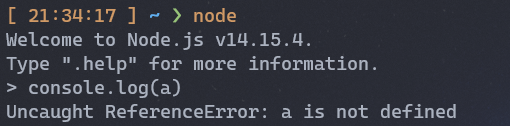

# JavaScript中的变量

## 写在前面

这篇文章我们将来学习JavaScript中的变量，这篇文章包含了变量的概念、声明、调用，以及在声明变量时的特殊情况等内容。

## 什么是变量

**变量** 是一个拥有名字的用来存储数据信息的容器。在JavaScript中，变量是弱类型的，所谓的弱类型法就是这个变量可以存储任何类型的数据信息。

> 强类型的编程语言只能存储指定类型的，否则就会报错。


我们在开发中通过使用变量要达到的目的具有 2 个：

- 存储数据信息：声明一个变量用来存储指定数据信息。

- 读取数据信息：调用一个变量从而得到其存储的数据信息。

在JavaScript中如果使用一个未声明的变量，将会抛出异常，示例代码如下图：



> 上面的代码就抛出一个`ReferenceError`，说明这个变量`a`没有定义。


## 变量的声明与使用

在 JavaScript 语言中声明一个变量需要使用`var`关键字，可以选择性的对这个变量进行初始化。

> 在ECMAScript2015中新增了`let`和`const`关键字，在现在编写代码时，`var`基本已经被淘汰了。关于`let`和`const`关键字我们会在**ECMAScript新特征** 中学习。


语法结构如下：

```JavaScript
var varname1 [= value1] [, varname2 [= value2] ... [, varnameN [= valueN]]];
```


上面的语法中`varname`表示变量名，如果只有一个变量名表示声明，`value`表示变量的值，如果声明一个变量，并为其赋值，表示声明初始化。

如下代码演示了`var`关键字的使用：

```JavaScript
var value1  // 仅仅声明

console.log(value1) // 访问仅声明的变量会得到一个 undefined

var value2 = 'this is value2'

console.log(value2) // 将会得到 this is value2
```


变量的值也可以被修改，示例代码如下：

```JavaScript
var message = 'Hello'
message = 'World'
console.log(message)
```


如果变量被重新赋值的话，之前的那个值就会被删除(*之前的值还存在别的变量引用除外* )，变量的赋值过程通过下图更好理解


### 变量命名的约定

每个变量名最好有一个明确的含义，杜绝使用`a`、`b`这样的变量名，还可以采用一种变量的命名方法，具体如下所示：

```JavaScript
var helloWorld = 'Hello World' //小驼峰命名法
var HelloWorld = 'Hello World' //大驼峰命名法
var hello_world = 'Hello World' //下划线命名法
```


## 使用var声明变量存在的问题

在JavaScript语言中声明变量时，还有一些操作是值得注意的。有些操作虽然可能运行代码时不会报错，但并不推荐的一些做法。

### 没有使用var关键字进行声明

前面我们介绍了声明一个变量使用的是`var`关键字，但实际上我们在除了严格模式以为的任何时候，JavaScript允许我们不通过`var`关键字来声明一个变量，示例代码如下：

```JavaScript
message = 'Hello World'
```


我们访问这个`message`变量也会得到`Hello World`这个内容。

虽然这样的允许的，但是在实际开发中，并不推荐这么使用。

### 重复声明

在JavaScript语言中使用`var`关键字重复声明变量是允许的，并且不会有任何问题。只不过由于JavaScript语言中的变量只能存储一个数据信息，所以当重复声明变量并进行初始化的话，之前的数据信息将会被覆盖。如下示例代码所示：

```JavaScript
var msg = 'this is message' // 值为 this is message
var msg = 100 // 值为 100
```


### 变量提升

JavaScript引擎的工作方式是，先解析代码，获取所有被声明的变量，然后再逐行执行。这造成的结果，就是所有的变量的声明语句，都会被提升到代码的头部，这就叫做**变量提升** 。

```JavaScript
console.log(a);
var a = 1;
```


上面代码首先使用`console.log`方法，在控制台显示变量`a`的值。这时变量`a`还没有声明和赋值，所以这是一种错误的做法，但是实际上不会报错。因为存在变量提升，真正运行的是下面的代码。

```JavaScript
var a;
console.log(a);
a = 1;
```


最后的结果是显示`undefined`，表示变量`a`已声明，但还未赋值。

> 在ECMAScript2015中新增了`let`和`const`关键字就不存在变量提升和重复声明的问题。


## 总结


