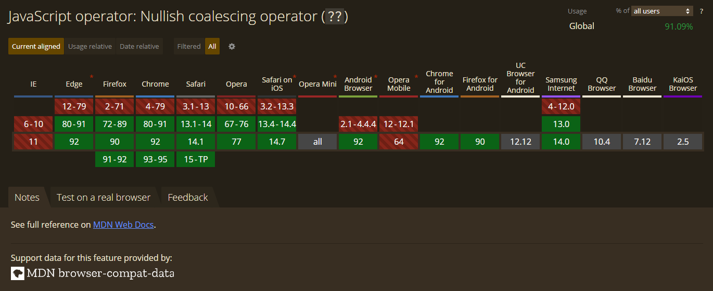
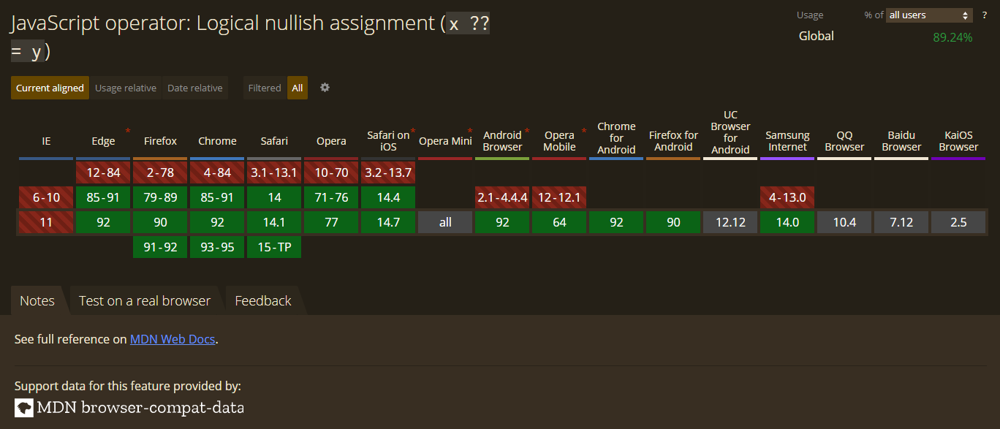
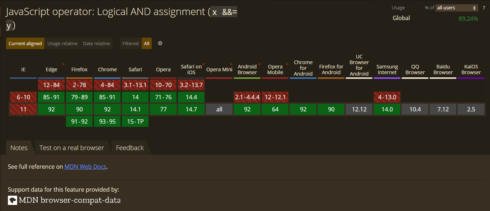
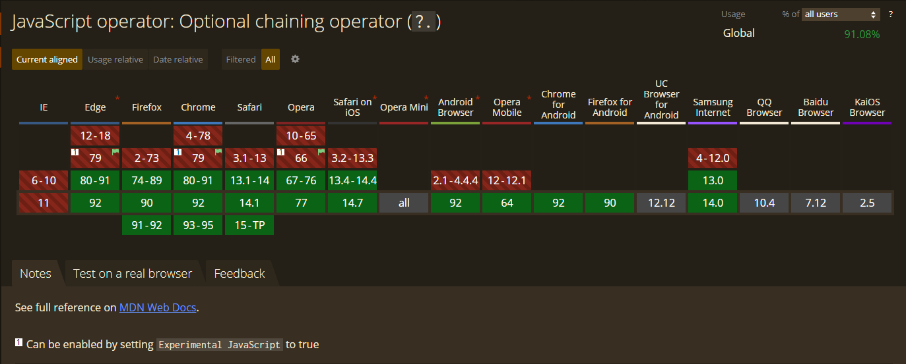
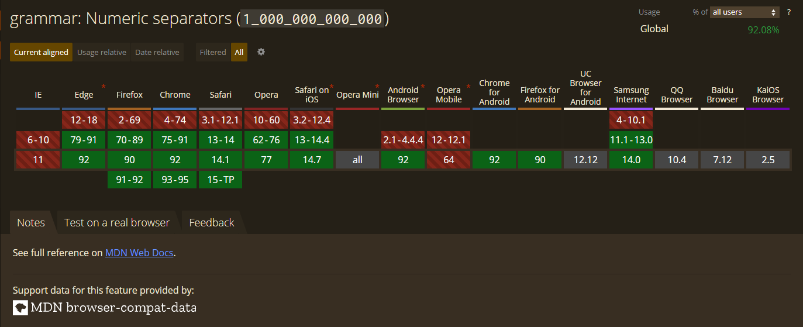

# 运算符

## 写在前面

本篇文章我们来学习JavaScript中的运算符，通过学习本篇本章我们可以掌握如下内容

.png)

> 本篇文章会涉及到ECMAScript6新增的运算符，该内容为扩展内容，写在这里的原因是为了对JavaScript中的运算符可以有一个全面的认识。


## 概述

#### 什么是JavaScript运算符

所谓的**运算符** 主要是用来针对一个或者多个操作数进行运算的。例如`1+2`，其中操作数为2和3（操作数又称**运算元** ），而运算符就是`+`号。

JavaScript中的运算符大部分都是由一些标点符号组成，例如`+`、`-`、`*`等。但是不仅仅只有符号，也有一些关键字，例如我们之前学习[typeof运算符](https://www.wolai.com/9iARsQ9VGhrpR8MoAViLVN)等。

### 运算符的分类

JavaScript中的运算符可以按照操作数的数量进行分类，也可以按照作用进行分类。

按照操作数数量分类：

- 一元运算符：只能操作一个操作数的运算符，例如自增运算符、`typeof`运算符等。

- 二元运算符：只能操作两个操作数的运算符，例如加法运算符、逻辑与运算符等。

- 三元运算符：可以操作三个操作数的运算符，例如条件运算符等

按照作用进行分类：

- 算数运算符

- 比较运算符

- 赋值运算符

- 逻辑运算符

- ......

### 运算符的优先级

当JavaScript 中使用了多种运算符时，由于每个运算符的执行顺序不同，导致最终执行的结果可能会有所不同。

例如下面这段代码：

```JavaScript
4 + 3 * 2 // 10
(4 + 3) * 2 // 14
```


我们可以看到执行顺序不同导致最终的结果也不相同。

JavaScript中的运算符的优先级如下图所示：


> **说明** ：上述运算符的优先级别图示，是由[MDN 社区提供](https://developer.mozilla.org/zh-CN/docs/Web/JavaScript/Reference/Operators/Operator_Precedence)。


由于JavaScript中的运算符的数量比较多，很多时候记不清具体运算符的优先级，在实际开发中有一个小技巧，将需要先运算的运算元使用`()`进行包括来实现先运算的目的。

## 算数运算符

JavaScript中的算数运算符大致又8个，具体如下图所示：


现在我们就来以此讲解这8种运算符具体怎么用

### 加法运算符`+`

JavaScript中的加法运算符除了可以**进行** `number`**类型的相加操作** 外，还有两种操作，分别是我们之前所讲解的隐式类型转换中的**隐式** [转换为number类型](https://www.wolai.com/rENoTx4sfXP3Ah8w9G7NeZ)和**字符串的拼接** ，现在我们分别来学习一下具体用法：

1. `number`类型的相加操作：

```JavaScript
var num1 = 20
var num2 = 30

console.log(num1 + num2) // 50
```


2. 隐式类型转换：

```JavaScript
console.log(+'123') // 123
console.log(+true) // 1
```


3. 字符串拼接（如果运算符两遍的运算元有一个不是`number`类型，其运算符的作用就是字符串拼接）：

```JavaScript
console.log('1' + true) // 1true
console.log(100 + '200') // 100200
```


&ensp;&ensp;&ensp;&ensp;> 我们之前学习的隐式[转换为string类型](https://www.wolai.com/jXiXCxr6TzLgXB6m7621zK)时，就用到了字符串的拼接


### 减法运算符`-`

JavaScript中的减法运算符具有两个功能，一个是**进行** `number`**类型的相减操作** ，另一个是**进行隐式类型转换** ，转换为number并取反（如果是number则直接取法），具体用法如：

1. `number`类型的相减操作：

```JavaScript
var num1 = 20
var num2 = 30

console.log(num1 - num2) // -10
console.log(num2 - num1) // 10
```


2. 隐式类型转换

```JavaScript
console.log(-'123') // -123
console.log(-true)  // -1
console.log(-666)   // -666
```


### 乘法运算符`*`和除法运算符`/`

JavaScript中的乘法运算符`*`和除法运算符`/`跟数学中的作用一致，代码如下：

```JavaScript
console.log(10 / 2) // 5
console.log(10 * 2) // 20

console.log(2 / 10) // 0.2
console.log(10 * 0.2) // 2

```


### 指数运算符`**`

JavaScript中的指数运算符是用于计算底数的指数次方结果，例如我们需要计算2的10次方，在JavaScript中的写法就是`2**10`，代码如下：

```JavaScript
// 2的10次方
console.log(2 ** 10) // 1024
```


### 取模运算符`%`

取模运算符又称取余运算符，其作用就是用来计算两个**运算元相除之后的余数** ，其中，运算符可以为负数，示例代码如下：

```JavaScript
console.log(10 % 3) // 1

// 运算元存在负数的情况
console.log(-5 % 2) // -1
console.log(5 % -2) // 1
console.log(-5 % -2) // -1
```


### 自增运算符`++`和自减运算符`--`

JavaScript中提供的自增运算符`++`和自减运算符`--`都是一元运算符，其作用如下：

- 自增运算符：将运算元（操作数）+1

- 自减运算符：将运算元（操作数）-1

自增和自减运算符有分为前置和后置两种其区别如下：

- 前置运算符：所谓的前置运算符就是**运算符在前运算元（操作数）在后** ，前置运算符会**先进行计算，后返回结果** 

- 后置运算符：所谓的后置运算符就是**前运算元（操作数）在前运算符在后** ，后置运算符会**先将** 当前运算元（操作数）的**数值进行返回，后进行计算** 

示例代码如下：

1. 自增运算符

```JavaScript
var x = 3
var y = 3

console.log(++x) // 4
console.log(y++) // 3

console.log("x的值为：" + x + ", y的值为: " + y) // x的值为：4, y的值为: 4
```


&ensp;&ensp;&ensp;&ensp;> 我们可以看到最终的结果都为4，但是在过程中其结果是不一致的


2. 自减运算符

```JavaScript
var x = 3
var y = 3

console.log(--x) // 2
console.log(y--) // 3

console.log("x的值为：" + x + ", y的值为: " + y) // x的值为：2, y的值为: 2
```


&ensp;&ensp;&ensp;&ensp;> 自减的道理同自增


## 比较运算符

JavaScript中的比较运算符的作用就是比较两个运算元（操作数），其操作数可以是任何类型的值，如果不是同一个类型的值得话会先进行类型转换，后进行比较，最后返回一个`boolean`类型的值，表示当前是否满足指定的条件。

JavaScript中的比较运算符共8中，具体如下图所示：


### 大于`>`、小于`<`、大于等于`≥`、小于等于`≤`

这四个运算符比较简单，跟数学中基本类似，需要注意的是比较两个`string`类型的值时，比较是其[Unicode](https://zh.wikipedia.org/wiki/Unicode)码。

示例代码如下：

```JavaScript
console.log(10 > 8) // true

// true 会被自动转换为number类型1，false会被自动转换为number类型0
console.log(true > false) // true

// string类型比较的是 Unicode 码的大小
console.log('A' > 'a') // false

// 这里的字符串111 会被自动转换为 number 类型
console.log(123 > '111') // true
```


> 其他三种符号的道理是一样的。


### 等于`==`和不等于`≠`运算符

等于`==`和不等于`≠`运算符这两个运算符比较的是两个运算元（操作数）值是否相等，并不会比较类型，也就是说`2`和`'2'`是相等的。示例代码如下：

```JavaScript
console.log(true == 1) // true

console.log(2 == '2') // true

console.log(1 == true) // true

console.log([] == '') // true
```


上面的代码中，每次比较前都会进行类型转换，转换成相同的数据类型才会进行比较。值得注意的是**空数组与空字符串相等** ，这是因为空数组转换为字符串就是一个空字符串。

```JavaScript
console.log(typeof String([])) // string
```


> 关于数组的知识在后面会进行介绍


### 全等`===`和不全等`≠=`运算符

JavaScript中提供了等于和不等于运算符仅仅能比较数值，并不会比较类型，这就会导致在开发中出现的一些细节错误，比如：

我们想要将`1`与`'1'`进行比较，如果相等就进行相加，我们可以看到两个值并不是相等的，但是使用JavaScript中的等于运算符得到的结果就是`true`，最后相加的结果为字符串拼接的结果。示例代码如需：

```JavaScript
var str = '1'
var num = 1

// 条件语句
if (str == num) {
    console.log(str + num) // 11
}
```


实际上我们想要结果是一个`number`类型，但是由于比较的是一个`number`和一个`string`，导致加法运算符进行的是字符串拼接结果，所以最终是一个`string`类型的值，这明显不是我们想要的结果。

> 关于条件语句，我们下节课学习


JavaScript中提供的全等和不全等运算符就帮助了我们解决了这种问题，示例代码如下：

```JavaScript
var str = '1'
var num = 1

console.log(str === num) // false
```


现在就可以解决我们上面存在的那个问题了。

## 逻辑运算符

JavaScript中的逻辑运算符只有三个，具体如下图所示：


逻辑运算符主要应用的运算元（操作数）是`boolean`类型的值，如果不是布尔值则会自动被转换成布尔值，关于什么值会自动转换为布尔值，可以参考[转换为boolean类型](https://www.wolai.com/rEsGt12UKkgTP7XEkmN5Jv)。

JavaScript中的逻辑运算符的具体用法如下：

### 逻辑非`!`运算符

JavaScript中的逻辑非运算符是一个一元运算符，其写法是一个英文叹号(`!`)，其作用如下：

如果运算元（操作数）的数据类型转换为`boolean`类型后的值为`true`的话，则返回`false`；如果运算元（操作数）的数据类型转换为`boolean`类型后的值为`false`的话，则返回`true`。简单来说就是**取反** 操作。

示例代码如下：

```JavaScript
console.log(!true)   // false
console.log(!false)  // true
console.log(!0)      // true
console.log(!1)      // false
console.log(!'')     // true
```


### 逻辑与运算符`&&`

逻辑与运算符采用两个`&`符号表示，其作用是用来运算两个运算元（操作数）并返回一个`boolean`类型的值。

> 参与计算的两个运算元（操作数）如果不是`boolean`类型会自动转换为`boolean`类型。


逻辑与运算符的计算规则如下：

- 如果左边运算元的值为`true`，右边运算元值也为`true`，则最终的结果为`true`

- 如果左右两边的运算元的值有一个为`false`，则最终结果为`false`。

示例代码如下：

```JavaScript
console.log(true && true)    // true
console.log(true && false)   // false
console.log(false && true)   // false
console.log(false && false)  // false
```


- 如果左边运算元转换为`boolean`类型的值后的值为`true`，则返回的是右边的操作数。

- 如果左边运算元转换为`boolean`类型的值后的值为`false`，则直接返回左边操作数。

&ensp;&ensp;&ensp;&ensp;> **值得注意的是，如果检测到左值为** `false`**，会直接返回结果，不会继续向下执行** （在实际开发中很有用）


示例代码如下：

```JavaScript
console.log(1 && 2) // 2
console.log(0 && 1) // 0
console.log(1 && '') // ''
console.log(true && 'str') // 'str'


// 这里我们使用了一个未定义变量value，如果检测到左值为false的话，就不会继续执行，否则将会报错，报错信息为：value is not defined
console.log(false && value) // false
```


### 逻辑或运算符`||`

逻辑或运算符采用两个`|`符号表示，其作用也是用来运算两个运算元（操作数）并返回一个`boolean`类型的值。

逻辑或的计算规则如下：

- 如果左边运算元的值为`true`，则最终的结果为`true`

- 如果左边运算元的值为`false`，则最终的结果为右运算元

- 如果左边运算元转换为`boolean`类型的值后的值为`true`，则返回的是左边的操作数。

- 如果左边运算元转换为`boolean`类型的值后的值为`false`，则返回的是右边的操作数。

示例代码如下：

```JavaScript
console.log(true || true)    // true
console.log(true || false)   // true
console.log(false || true)   // true
console.log(false || false)  // false


console.log(1 || 2) // 1
console.log(0 || 1) // 1
console.log(1 || '') // 1
console.log(true || 'str') // true

```


## 赋值运算符

所谓的赋值运算符，就是将右边表达式的计算结果赋值给左边的变量，我们之前使用的`=`就是赋值运算符，JavaScript中除了这个运算符还有如下赋值运算符


其中，除了`=`号，剩下的统称为**复合赋值运算符** 。

### 复合赋值运算符

所谓的复合赋值运算符，就是算数运算符和赋值运算符的简写，我们这里以加法赋值运算符为例，语法结构如下：

```JavaScript
x += y
```


上面的语法，是与`x = x + y`相同的，也就是说，所谓的复合数值运算符，就是将右边的运算元（操作数）与左边的运算元（操作数）进行某种计算，并将计算结果赋值给左边运算元。

示例代码如下：

```JavaScript
var num = 10

var result1 = 20
var result2 = 20


// 加法赋值运算符
result1 += num
result2 = result2 + num

console.log(result1 === result2) // true


// 减法赋值运算符
result1 -= num
result2 = result2 - num

console.log(result1 === result2) // true


// 指数赋值运算符
result1 **= num
result2 = result2 ** num

console.log(result1 === result2) // true
```


### 链式赋值

JavaScript语言是支持链式赋值的，什么是链式赋值呢？看下面代码就知道了

```JavaScript
var a = 10
var b = 20
a += b -= 10
console.log(a) // 20
```


链式赋值从右到左进行依次赋值。在上面的代码中，我们先将`b -= 10`的值计算出来，将其赋值给`b`，然后在计算`a += b`，所以最终的结果为20。

## 其他运算符

除了上面哪些有着自己的家族的运算符，还有一些特别的运算符，它们总是单兵作战，却在实际开发中很重要，我们来看下具有包含哪些


### 条件运算符`?:`

JavaScript中的条件运算符，是JavaScript中唯一一个三元运算符，其语法结构如下：

```JavaScript
条件 ? 值1 : 值2
```


当条件为`true`或者可以类型转换为true时，这个表达式返回的结果为`值1`，否则这个表达式返回的结果为`值2`。

示例代码如下：

```JavaScript
var age = 20
var result = age > 18 ? '成年人' : '未成年人'
console.log(result) // 成年人
```


上面的代码中，由于我们的变量`age`的值为20，是大于18的，所以这个表达式部分的结果就为`true`，最终将`成年人`赋值给`result`变量

**条件运算符链** 

条件运算符不仅是唯一一个三元运算符，还有就是条件运算符的第三个表达式还可以是一个条件运算符，依次类推，形成一种链状。这就被称为**条件运算符链** 。示例代码如下：

```JavaScript
var score = 85
var result = score >= 90 ? '优秀'
    : score >= 80 ? '良好'
        : score >= 60 ? '合格' : '不合格'


console.log(result) // 良好
```


上面的代码中，先执行`score >= 90`这个表达式的结果为`false`，所以执行``score >= 80 ? '良好' : score >= 60 ? '合格' : '不合格'`，这个表达式，执行这个表达式的时候，先执行`score >= 80`这个表达式，其结果为`true`，所以最终的结果为`良好`，如果这个表示的结果还是为`false`，就依次往下执行。

条件运算符链又称为**条件运算符的嵌套结构** 。

### 分组运算符`()`

JavaScript中的`()`为分组运算符，在所有运算符中优先级最高，这个运算符没有别的含义，主要就是可以让某些表达式优先执行。示例代码如下：

```JavaScript
var result1 = 1 + 2 * 3 / 4 % 5 ** 6
/**
 * 上面的执行顺序为 
 * 指数运算符的执行顺序为 16，先执行 5 ** 6 结果为 15625
 * 乘 除 模 的执行顺序为 15，这里从 2 * 3 开始 从左向右依次执行
 * 最后计算执行顺序为14的加法
 */
console.log(result1)

// 如果通过()分组的方式计算，就可以得到不一样的结果
var result2 = ((1 + 2) * 3 / 4 % 5) ** 6
/**
 * 我们这里可以通过使用()，从而实现从左向右依次执行
 */
console.log(result2,)
```


## ES6新增的运算符（扩展内容）

在ES6中又增加了许多新的运算符，这里将会介绍一些常用的运算符，具体如下图所示：

> 注：这里的ES6仅仅是一个统称，即ECMAScript2015之后的版本统称为ES6


> 这里会介绍一些目前没有接触的内容，例如数组、对象，将这些运算符记录在这里的目的是为了使这篇文章更具有可收藏性。


### 展开运算符`...`

展开运算符是三个点(`...`)，展开运算符又分为对象展开运算符和数组展开运算符。

#### 数组展开运算符

数组展开运算符用于将一个数组转换为用逗号分割的参数列表，示例代码如下：

```JavaScript
// 定义一个数组

var arr = [1, 2, 3, 4, 5]


console.log(...arr) // 1 2 3 4 5
// 这里得到 1 2 3 4 5 的原因是因为我们将数组展开成一个以 , 分割的列表，这个就为作为参数使用了，与下相同

console.log(1, 2, 3, 4, 5) // 1 2 3 4 5
```


**深拷贝一个数组** 

我们可以用展开运算符对数组进行深拷贝，示例代码如下：

```JavaScript
// 定义一个数组

var arr = [1, 2, 3, 4, 5]

// 浅拷贝
var arr1 = arr

// 深拷贝 
var arr2 = [...arr]

// 进行比较时，浅拷贝与原数组相同
console.log(arr1 === arr);
// 深拷贝就与原数组不同
console.log(arr2 === arr);
/**
 * 这是因为浅拷贝拷贝的是内存地址，而深拷贝拷贝的是具体的值
 */

// 当我们修改原数组后，浅拷贝的值也会跟着一起改变而深拷贝不会
arr[0] = 10 // 将原数组的第一个值修改为10
console.log(arr1) // [ 10, 2, 3, 4, 5 ]
console.log(arr2) // [ 1, 2, 3, 4, 5 ]

```


> 关于深浅拷贝的详细内容，会在后面进行讲解


#### 对象展开运算符

在ECMAScript2018的时候，将展开运算符引入对象中使用，其作用除了可以展开一个对象之外，还可以在结构赋值时，用于读取剩余属性。示例代码如下：

```JavaScript
// 定义一个对象
var person = {
    name: '彼岸繁華',
    hobby: 'coding',
    age: 18
}

// 深拷贝一个对象
var person2 = { ...person }


// 结构赋值时，接受剩余的值
var { name, ...obj } = person
console.log(name, obj) // 彼岸繁華 { hobby: 'coding', age: 18 }
```


> 值得注意的是，展开运算符只能复制自身的属性，不能复制从继承与原型对象的属性。


### 空值合并运算符`??`

空值合并运算符是由两个问号来表示，该运算符也是一个逻辑运算符，该运算符与逻辑或运算符类似。其计算规则为，只要左运算元为`null`或者`undefined`，则返回右运算元，否则返回左运算元。而逻辑或运算符只有左运算元转换为`boolean`类型后为`false`，就返回右运算元。

示例代码如下：

```JavaScript
console.log(null ?? 10) // 10
console.log(undefined ?? 10) // 10
console.log(false ?? 10) // false
```


该运算符用于为没有值的变量赋值很有用，例如：如果这个数没有值，就为其赋值，否则不赋值，示例代码如下：

```JavaScript
var value

// 如果value的值不为 null 或者 undefined 为其赋值10
value = value ?? 10
console.log(value) // 10
```


> 值得注意的是**空值合并运算符** 与**逻辑与和逻辑或不能同时使用** ，否则会抛出异常，解决方案是通过使用`()`来表明优先级


浏览器兼容性如下：



> 上图来源自：Can I use


### 空值合并赋值运算符`??=`

我们上面的`value = value ?? 10`可以简写为`value ??= 10`。空值合并赋值运算符也是复合赋值运算符的一种，其目的就是简化上面的那种写法。

浏览器兼容性如下：



> 上图来源自：Can I use


### 逻辑与赋值运算符`&&=`和逻辑或赋值运算符`||=`

逻辑与赋值运算符和逻辑或赋值运算符`||=`也是复合赋值运算符的一种，它出现的目的就是为了简化代码。示例代码如下：

```JavaScript
var x = 0;
var y = 1;

x &&= 0; // 0 
x &&= 1; // 0
y &&= 1; // 1
y &&= 0; // 0
// 上面的代码等价于
x = x && 0
x = x && 1
y = y && 1
y = y && 0
```


`&&=`的浏览器兼容性如下：



`||=`的浏览器兼容性如下：


> 上图来源自：Can I use


### 可选链操作符`?.`

可选链操作符用于读取某对象链下深处属性的值，使用这个操作符不必验证对象下的每个属性必须存在，例如我们想要访问`A.a.b`这个属性时，我们首先需要确保`A`存在，然后需要确保`A.a`存在，才可以访问`A.a.b`这个属性，不然就会报错。

使用可选链操作符就不会出现这样的问题，当我们访问某个属性时，只要有一处不存在，就会返回`undefind`，不会报错。

```JavaScript
var A = {}

// console.log(A.a.b) // 报错

console.log(A.a?.b) // undefined
```


可选链操作符也可用于对象下方法的调用，示例代码如下：

```JavaScript
var obj = {}

// 如果存在 obj.fun() 这个方法，下面则会直接调用，如果不存在则会返回undefined
obj.fun?.A()
```


浏览器兼容性如下：



> 上图来源自：Can I use


### 数值分隔符`_`

严格意义上讲数值分隔符(`_`)并不属于一个运算符，其作用就是使数字更加利于阅读，例如下面的代码

```JavaScript
console.log(1_0000_0000) // 100000000
```


这个符号仅仅起到了便于阅读的目的，有与没有的结果并不影响，看下面的代码

```JavaScript
1_1 === 11 // true
```


其浏览器兼容性如下：



> 上图来源自：[Can I use](https://caniuse.com/?search=Numeric%20separators)


## 总结

.png)

