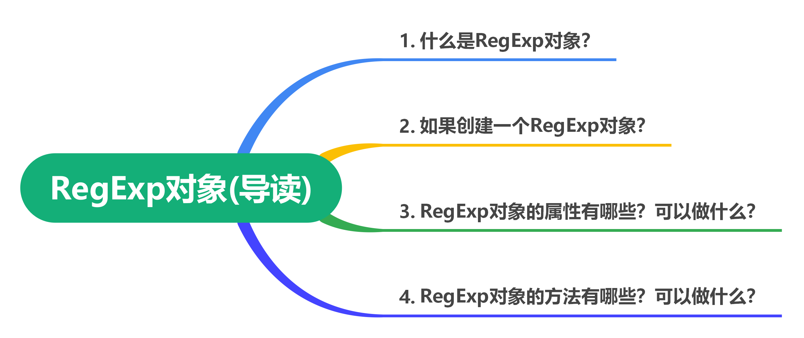
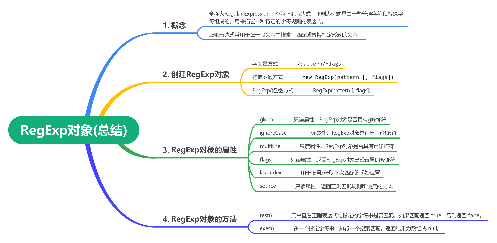

# RegExp对象

## 写在前面

本篇文章我们将来学习JavaScript中的`RegExp`对象，通过本篇文章的学习可以掌握什么知识呢？如下图：




## 什么是RegExp对象

JavaScript提供了RegExp对象，该对象的全称为**Regular Expression** ，译为正则表达式。正则表达式是由一些普通字符和特殊字符组成的，用来描述一种特定的字符规则的表达式。

正则表达式常用于在一段文本中搜索、匹配或替换特定形式的文本。如：词语出现频率统计、验证字符串是否符合邮箱格式、屏蔽一篇帖子中的限制性词语等。

很多开发语言都支持正则表达式，而JavaScript支持正则表达式的方式就是提供了RegExp对象。

> **说明** ：本篇文章主要来学习JavaScript中提供的`RegExp`对象对正则的操作。关于正则表达式的匹配规则，可以通过[JS正则表达式完整教程（略长） (juejin.cn)](https://juejin.cn/post/6844903487155732494)这篇文章来学习。


## 创建正则表达式

与创建数组类似，创建正则表达式同样具有字面量方式、构造函数方式和`RegExp()`函数方式 3 种，并且这三种方式创建的正则表达式没有任何区别。

### 字面量方式

字面量方式创建正则表达式指的是根据ECMA-262标准规范中定义的正则表达式的结构来创建正则表达式。JavaScript中的正则表达式的基本语法结构如下：

```JavaScript
/pattern/flags
```


- `pattern`：表示正则表达式的匹配规则

- `flags`：可选项，表示正则的匹配模式。

&ensp;&ensp;&ensp;&ensp;- `g`表示全局搜索

&ensp;&ensp;&ensp;&ensp;- `i`表示忽略大小写

&ensp;&ensp;&ensp;&ensp;- `m`表示多行匹配

根据上述的语法结构，如下示例代码展示了如何使用字面量方式定义一个正则表达式：

```JavaScript
var pattern = /[bc]at/i
console.log(pattern) // /[bc]at/i
```


上述示例代码的正则表达式表示匹配某个字符串中的第一个`bat`或`cat`，并且不区分大小写。

### 构造函数方式

JavaScript提供了`RegExp()`构造函数用来创建一个RegExp对象，该类型提供了一系列的属性和方法完成某些特定的功能。其语法结构如下所示：

```JavaScript
new RegExp(pattern [, flags])
```


参数和上面是一样的，如下示例代码展示了如何使用构造函数方式定义一个正则表达式：

```JavaScript
var pattern1 = new RegExp('[bc]at', 'i')
var pattern2 = new RegExp(/[bc]at/, 'i')

console.log(pattern1, pattern2) // /[bc]at/i /[bc]at/i
```


上述示例代码中`RegExp()`构造函数中的`pattern`参数，无论是`'[bc]at'`的写法还是`/[bc]at/`的写法，其效果是一致的。

### RegExp()函数方式

JavaScript中同样提供了`RegExp()`函数来创建一个正则表达式，其语法结构如下所示：

```JavaScript
RegExp(pattern [, flags])
```


参数和上面是样的，如下示例代码展示了如何使用`RegExp()`函数方式定义一个正则表达式：

```JavaScript
var pattern1 = RegExp('[bc]at', 'i')
var pattern2 = RegExp(/[bc]at/, 'i')

console.log(pattern1, pattern2) // /[bc]at/i /[bc]at/i
```


## RegExp对象的属性

RegExp对象提供的常用的属性包含六个，其中有五个都是只读属性，具体如下：

|属性名|描述|
|---|---|
|`global`|只读属性，RegExp对象是否具有`g`修饰符|
|`ignoreCase`|只读属性，RegExp对象是否具有`i`修饰符|
|`multiline`|只读属性，RegExp对象是否具有`m`修饰符|
|`flags`|只读属性，返回RegExp对象已经设置的修饰符|
|`lastIndex`|用于设置/获取下次匹配的起始位置|
|`source`|只读属性，返回正则匹配规则所使用的文本|


### 检测RegExp对象的修饰符

示例代码如下：

```JavaScript
var re = /abc/igm;

re.ignoreCase // true
re.global // true
re.multiline // true
re.flags // 'gim'
```


### 返回正则匹配规则

示例代码如下：

```JavaScript
var re = /abc/igm;

re.source // "abc"
```


### 获取/设置匹配起始位置

示例代码如下：

```JavaScript
var re = /abc/igm;

re.lastIndex // 0
```


> 关于设置匹配起始位置，在学习RegExp对象的方法时学习。


## RegExp对象的方法

RegExp对象提供了两个常用方法，具体如下：

### test()方法

`test()`方法用于查看正则表达式与指定的字符串是否匹配。如果匹配返回`true`，否则返回`false`。

示例代码如下：

```JavaScript
var str = 'JavaScript'
var re = /Java/
var result1 = re.test(str)
console.log(result1) // true
```


带有`g`修饰符时，可以通过正则对象的`lastIndex`属性指定开始搜索的位置。示例代码如下：

```JavaScript
// var str = 'JavaScript'
// var re = /Java/
// var result1 = re.test(str)
// console.log(result1) // true

var str = 'JavaScript'
var re = /Java/g
console.log(re.lastIndex) // 0
var result1 = re.test(str)
console.log(result1) // true

// 当带有g修饰符后，匹配一次之后，lastIndex的属性会根据匹配到位置发生变化
console.log(re.lastIndex) // 4

var result2 = re.test(str)
console.log(result2) // false

// 修复lastIndex属性的值
re.lastIndex = 0

var result3 = re.test(str)
console.log(result3) // true
```


### exec()方法

`exec()`方法和`test()`方法基本一致，不同的是返回值。该方法返回一个数组，如果匹配失败返回`null`。示例代码如下：

```JavaScript
var str = 'JavaScript'
var re = /Java/
var result1 = re.exec(str)
console.log(result1) // [ 'Java', index: 0, input: 'JavaScript', groups: undefined ]
```


## 总结


