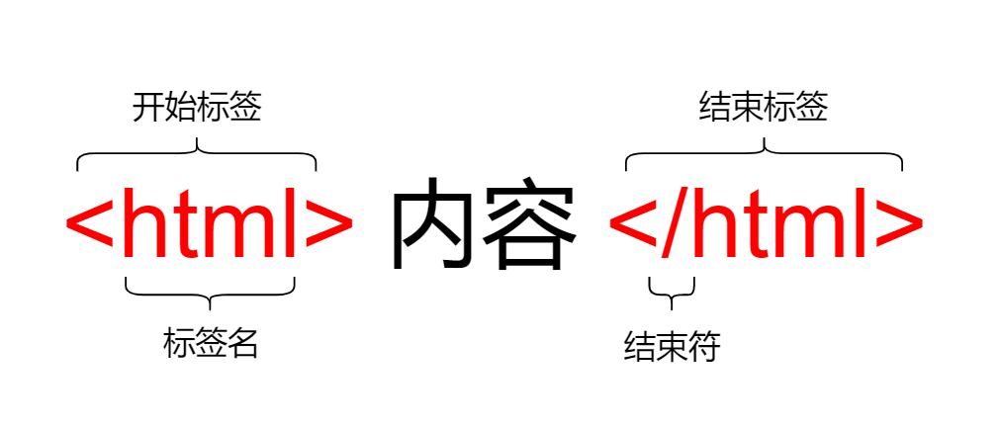
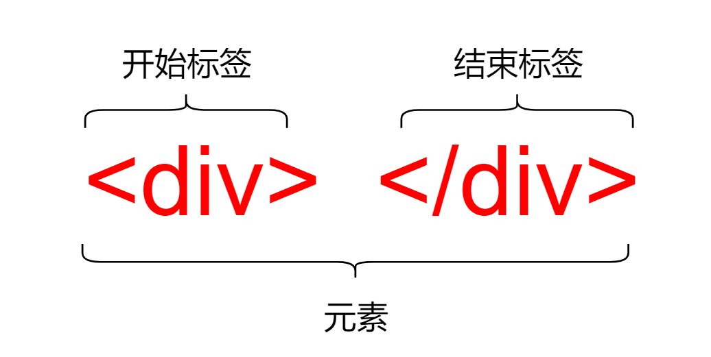
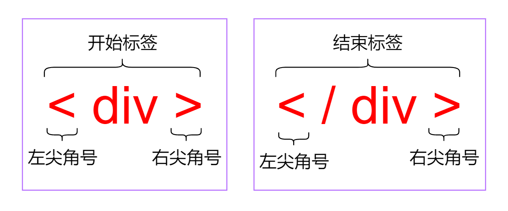
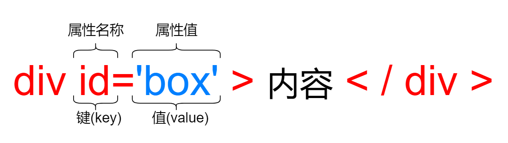
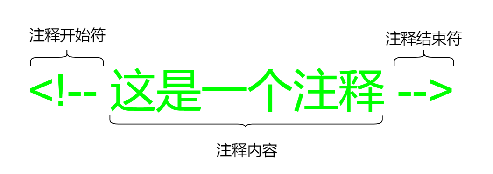
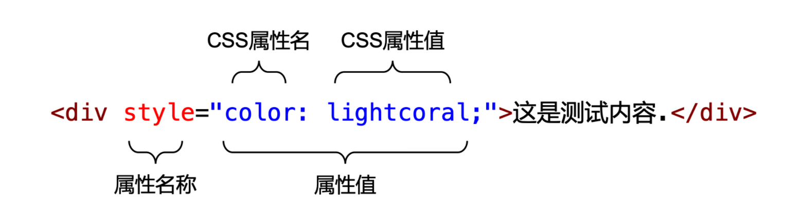
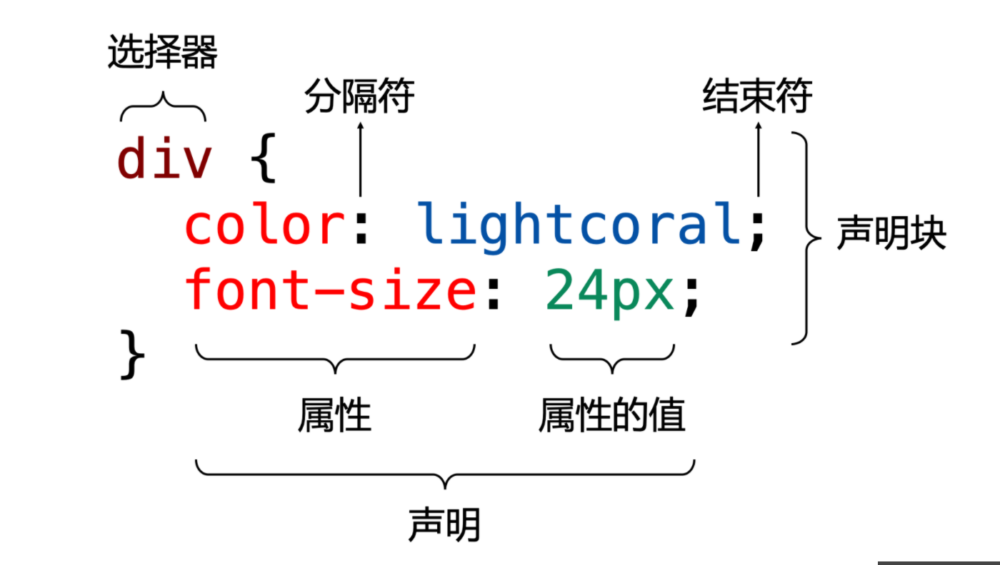
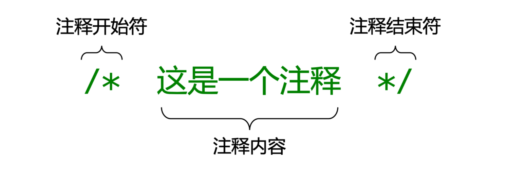

# HTML和CSS基础入门

## 写在前面

我们通过前面15篇文章把JavaScript的基础语法学习了一遍。从这篇文章开始，我们将来学习HTML和CSS以及其新特性。

本篇文章我们将来学习HTML和CSS的概念以及用法。具体如下图所示：


## HTML概述

### 什么是HTML

HTML是个缩写形式，其全称为**Hyper Text Markup Language** ，翻译成中文的含义为**超文本标记语言** 。HTML不是一门编程语言，而是一门标记语言，因为HTML是由一系列的**元素** 组成，这些元素可以包含文本、超链接等不同内容。

**名称解释** 

- **超文本** ：超文本是一种可以显示在电脑显示器或电子设备上的文本，现时超文本普遍以电子文档的方式存在，其中的文字包含有可以链接到其他字段或者文档的超链接，允许从当前阅读位置直接切换到超链接所指向的文字。随着HTML的发展，到目前为止已经不仅仅是文本内容这么简单，还可以显示图片、链接、音乐，甚至视频等更复杂的内容。

- **标记语言** ：标记语言中的标记指的就是HTML中的元素，而HTML就是由这样的一系列元素组成的，所以被称为标记语言。

接下来我们就来展示一下一个元素的结构,如下图所示:



值得注意的是：`<html>`元素是比较特殊的元素，称为根元素。在一个 HTML 页面中只能存在一个`<html>`元素，即使编写了多个`<html>`元素，运行HTML页面时浏览器也会自动忽略。

### HTML发展

- 1980年，蒂姆·博纳斯-李创建了最初仅有少量标记（TAG）

- 1993年，马克·安德在浏览器中加入``标记，从此可以浏览图片

### HTML的版本发展

自 1993 年之后HTML出现真正意义上的第一版，发展到至今，经历了5个大版本的更新和迭代。具体每个版本发布的时间如下：

- 超文本标记语言（第一版）——1993年6月作为互联网工程工作小组（IETF）工作草案发布（非标准）

- HTML2.0——1995年11月作为RFC1866发布，在RFC2843于2000年6月发布之后宣布已经过时

- HTML3.2——1997年1月4日，W3C推荐标准

- HTML4.0——1997年12月18日，W3C推荐标准

- HTML4.01（微小改进）——1999年12月24日，W3C推荐标准

- HTML5第一份正式草案，2008年1月22日，2014年10月29日正式发布

## 一个HTML页面

### HTML结构

一个基本的HTML结构如下所示：

```html
<!DOCTYPE html>     <!--HTML的声明-->
<html lang="en">              <!--根标签/元素-->
    <head>          <!--HTML的头部-->
    </head>         <!--HTML的头部结束-->
    <body>          <!--HTML的主体-->
    </body>         <!--HTML的主体结束-->
</html>             <!--根标签结束-->
```


HTML基本结构

- HTML的文档文件的后缀名为`.html`和`.htm`，两者没有区别

- HTML文档也被称为网页

- HTML文档包含HTML标签和纯文本

### `<!DOCTYPE>`声明

HTML页面的第一行一般都是编写HTML声明。HTML声明的作用就是当浏览器运行该HTML页面时来告知浏览器当前HTML页面的版本，这样浏览器会准确地进行解析并展示其内容。

HTML声明必须要编写在HTML页面的第一行，一般都是在`<html>`元素之前。并且HTML声明之前不能存在空行或者空格，不然会导致HTML声明失效。

浏览器发展至今，其功能也非常的强大。所以，如果HTML页面没有定义`<!DOCTYPE>`声明的话，浏览器也可以正确地解析该TML页面并进行显示。但是，还是**建议在编写HTML页面时定义** `<!DOCTYPE>`** 声明** 。

> 其实现在编辑器默认一般都会生成HTML结构，`<!DOCTYPE>`声明也不需要手动写了


### HTML元素

除了HTML声明之外，其他内容都是HTML元素。首先，需要搞清楚元素（Element）和标签（Tag）之间的区别

- **元素（Element）** ：是用来包含文字、图片或者音视频的内容，一般是**由标签和内容组成** 。

- **标签（Tag）** ：是**元素的组成部分** ，一般分为**开始标签** 和**结束标签** 。

#### HTML元素

HTML元素是HTML的重要组成部分之一，如下图所示展示了HTML元素的语法结构：



HTML元素可以分为**闭合元素** 和**空元素** 两种类型：

- 闭合元素：具有开始标签和结束标签，而且开始标签和结束标签是成对出现的。如下示例代码展示了闭合元素：

```html
<div>文本内容</div>
```


- 空元素：只有开始标签，而没有结束标签。如下示例代码展示了空元素：

```html
<input type="text">
```


值得注意的是，在编写HTML元素时，如果是闭合元素不要忘记结束标签，如果是空元素不要编写结束标签。

#### HTML标签

HTML标签实际上是HTML元素的组成部分之一，分为**开始标签** 和**结束标签** 。

- 开始标签：表示某个元素是从这里开始的。

- 结束标签：表示某个元素是到这里结束的。

如下图所示展示了标签的结构：



#### HTML元素的属性

属性是HTML元素的重要组成部分，用来定义某个元素的信息。例如为`<div>`元素定义ID属性，就是定义了唯一标识。

属性定义在元素的开始标签中，这样无论是闭合元素还是空元素都可以正常使用属性。属性的语法结构是键值对形式的。如下图所示展示了属性的语法结构：



- 属性名：其数量和作用都是HTML给定的。

- 属性值：属性对应的值，一般使用一对双引号进行包裹。

同一个元素是允许编写多个不同的属性的，但在同一个元素中不能同时定义多个相同的属性。再有就是HTML 元素的属性可以划分为以下 4 种：

1. 标准（通用）属性：HTML元素几乎都具有的属性，例如`id`、`name`、`style`和`class`属性等。

2. 专有（私有）属性：HTML中某些元素特有的属性，例如`<form>`元素的`action`属性等。

3. 事件属性：用来为HTML元素注册DOM事件的属性，例如`onclick`属性等。

4. 自定义属性：第三方框架中为了完成某个特定功能而定义的属性，例如Vue框架的 `v-if` 属性等。

### HTML头部

HTML头部具体是指`<head>`元素以及该元素所包含的所有元素，其作用是用来定义当前HTML页面的基本信息，例如HTML页面的标题、编写格式、作者、关键字以及描述等内容。

#### `<head>`元素

`<head>`元素是HTML页面基本结构中的组成部分，其作用是定义HTML页面的基本信息。可定义在`<head>`元素内的元素有如下：

- `<title>`元素：定义HTML页面的标题，显示在浏览器的标题或标签页上。如下示例代码所示展示了`<title>`元素的用法：

```HTML
<title>彼岸繁華的页面</title>
```


- `<base>`元素：定义HTML页面中所有相对URL的根 URL。如下示例代码所示展示了`<base>`元素的用法：

```html
<base target="_blank" href="http://www.example.com/">  
```


&ensp;&ensp;&ensp;&ensp;> 值得注意的是，一个页面只允许使用一个`<base>`元素，如果存在多个只有第一个生效。


- `<link>`元素：定义HTML页面引入的外部资源，比较常见的是引入外部CSS文件或图标文件等。如下示例代码所示展示了通过`<link>`元素引入外部 CSS 文件：

```html
<link href="link-element-example.css" rel="stylesheet">
```


&ensp;&ensp;&ensp;&ensp;如下示例代码所示展示了通过`<link>`元素引入外部图标文件：

```html
<link rel="icon" href="favicon.ico">
```


- `<style>`元素：定义HTML页面的CSS样式，一般称为内嵌样式表。如下示例代码所示展示了通过`<style>`元素定义内嵌样式表.

- `<meta>`元素：定义HTML页面的元数据信息，例如编码格式、作者、关键字等。

- `<script>`元素：定义HTML页面的可执行的脚本，一般多为JavaScript脚本。

#### `<meta>`元素

`<meta>`元素是用来定义不能由`<base>`、`<link>`、`<script>`、`<style>`和`<title>`元素定义的元数据信息。并且`<meta>`元素是个空元素。

`<meta>` 元素常用的用法如下所示：

- 为搜索引擎定义关键词：

```html
<meta name="keywords" content="HTML, CSS, XML, XHTML, JavaScript">
```


- 为网页定义描述内容：

```html
<meta name="description" content="Free Web tutorials on HTML and CSS">
```


- 定义网页作者：

```html
<meta name="author" content="彼岸繁華">
```


- 每30秒中刷新当前页：

```html
<meta http-equiv="refresh" content="30">
```


- HTML5版本定义编码格式：

```html
<meta charset="UTF-8">
```


- 定义HTML页面的视口：

```html
<meta name="viewport" content="width=device-width, initial-scale=1.0">
```


### HTML注释

与很多开发语言类似，HTML提供了编写注释的语法内容。在浏览器运行HTML页面时，浏览器会自动忽略注释里面的内容，用户是看不到HTML页面中有关注释的内容的。

当一段内容被`<!--` 和 `-->`包裹起来时，那么这段内容就是一个注释内容了。如下图所示展示了 HTML 注释的语法结构：



注释可以用来更好地描述某一段HTML代码的含义或作用。无论是自己一段时间之后回顾代码，还是别人处理这段代码，注释都是起到了很大作用的。

## CSS概述

### 什么是CSS

CSS是个缩写形式，其全称为**Cascading Style Sheets** ，翻译成中文的含义为**层叠样式表** 。CSS是用来定义HTML元素显示的样式和布局方式，例如设置显示字体的颜色、大小等效果。

CSS的出现真正做到了将网页样式和内容有效进行分离，其中HTML元素用于展示内容，CSS用于定义样式。

### 浏览器的默认样式

如果创建一个HTML页面，定义一些HTML元素并且不定义任何CSS样式，然后使用不同的浏览器运行如上所述HTML页面，我们会发现不同浏览器显示的文本内容的字体样式是不同的。

会产生这样结果的原因在于，浏览器在解析HTML页面时会提供一个浏览器的默认样式，而不同的浏览器所提供的这个默认样式内容是不相同的。

我们通过CSS设置HTML页面的样式，会覆盖掉浏览器的默认样式，从而使得HTML页面在不同浏览器中运行时显示的效果是一样的。

### CSS发展

- 1994年哈坤·利提出了CSS的最初建议和伯特·波斯一个合作设计CSS

- 1997年初，W3C内组织接管CSS的工作组

### CSS的版本发展

- CSS1——作为一项W3C推荐，发布于1996年12月17日。1999年1月11日被推荐重新修订

- CSS2——作为一项W3C推荐，发布于199年1月11日。添加了对媒介（打印机和听觉设备）和可下载字体的支持

- CSS3——计划将CSS划分为更小的模块

## 如何使用 CSS

CSS样式主要的应用场景是在HTML页面中，其作用就是为HTML页面设置在浏览器运行后的显示效果。而在HTML页面使用CSS样式具有三种方式：

- 内联样式

- 内嵌样式表

- 外联样式表

### 内联样式

HTML元素的`style`属性的作用是为该元素设置CSS样式。

语法结构如下：

```css
style="CSS属性: CSS属性值;"
```


如下示例代码所示展示了内联样式的写法：

```html
<div style="color: lightcoral;">这是测试内容.</div>
```


内联样式的语法结构如下图所示：



使用内联样式的优点在于简单、直接。HTML元素的`<style>`属性属于标准属性，也就是说HTML所有的元素都可以通过`<style>`属性来定义CSS样式。

但使用内联样式的缺点也非常明显，具体缺点如下：

1. HTML内容与CSS样式属于强耦合，并没有实现网页的内容和样式的有效分离。

2. 如果为不同元素设置相同的CSS样式的话，会导致相同的CSS样式代码被重复定义，产生冗余代码。

### 内嵌样式表

HTML`<head>`元素中的`<style>`元素可以用来为当前HTML页面的元素设置CSS样式。

语法结构如下

```HTML
<style type="text/css">     <!--HTML5可以加这个type="text/css"-->
    选择器{
        属性名: 属性值;
    }
</style>
```


如下示例代码所示展示了内嵌样式表的写法：

```html
<style>
  p {
    color: lightcoral;
    font-size: 24px;
  }
</style>
```


使用内嵌样式表的优点在于解决内联样式中的两个问题：

- HTML内容与CSS样式的强耦合问题，使得网页的内容和样式有效地分离。

- 如果为不同元素设置相同的CSS样式的话，只需要定义一次CSS样式代码。

但内嵌样式表依旧编写在HTML文件中。如果一个HTML页面中包含大量的CSS样式的话，会导致HTML文件变得很大，从而浏览器加载HTML页面时耗时变长。

### 外联样式表

CSS样式代码可以定义在一个CSS文件中，这样有效地解决了内嵌样式表中的问题。具体的做法如下所示：

1. 创建一个扩展名为`.css`的文件，并且将CSS样式代码编写在这个文件中。

2. 在HTML页面中，通过`<head>`元素中的`<link>`元素将创建的CSS文件引入到HTML页面中。如下示例代码所示展示了`<link>`元素如何引入CSS文件：

```html
<link rel="stylesheet" href="style/demo.css">
```


&ensp;&ensp;&ensp;&ensp;- `rel`属性：用来定义引入文件与当前HTML页面的关系，该属性值必须是[链接类型值](https://developer.mozilla.org/zh-CN/docs/Web/HTML/Link_types)。

&ensp;&ensp;&ensp;&ensp;- `href`属性：用来定义引入文件的URL。

**说明** ：一个HTML页面允许引入多个CSS文件，多个CSS文件的加载顺序按照HTML页面引入的顺序进行加载。

### 三种样式的的优先级别

1. 内联样式的优先级是最高的

2. 内嵌样式表和外联样式表与编写顺序有关，最后的优先别更高

## CSS的语法结构

无论是以上三种方式引入CSS样式的哪一种，我们都需要学习CSS的语法结构，这也是学习CSS后续内容的基础。 如下示例所示展示了CSS样式的基本代码结构：

```CSS
div {
  color: lightcoral;
  font-size: 24px;
}
```


如下图所示展示了CSS 的语法结构以及相关概念：



CSS语法的基本结构可分为：

- **选择器** ：用来定位当前HTML页面中的元素，可以是一个元素也可以是多个元素（元素集）。

- **声明块** ：用来包含一个或多个CSS声明，其语法结构是一对花括号。

### CSS 声明

CSS 语法结构中除了**选择器** 之外，就是**声明** 了。CSS声明是一个由CSS定义的规则，具体的语法结构是一对键/值对形式。

CSS声明的语法结构可分为：

- 属性：用来定义HTML元素样式的方式，是由CSS给定的。例如`color`属性是用来定义元素的文本颜色等。

- 属性的值：用来定义HTML元素的样式。例如`color`属性的值可以是`lightcoral`等。

- 分隔符：是一个冒号（**:** ），用来分隔 CSS 属性和值的。

- 结束符：是一个分号（**;** ），用来表示一个CSS声明结束。

### CSS注释

CSS与HTML同样提供了**注释** ，其作用也与HTML的注释类似。不过CSS的注释语法与HTML不同，如下图所示展示了CSS注释的语法结构：



## 总结


