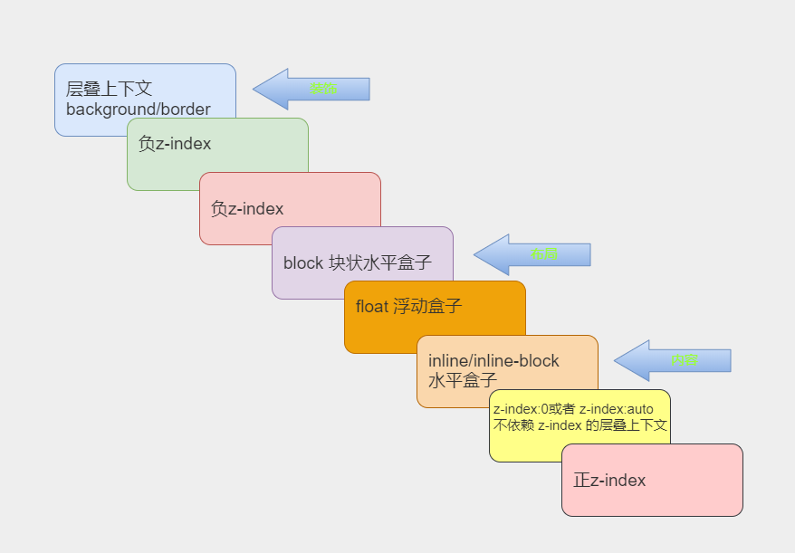

# 层叠上下文和层叠水平

## 写在前面

本篇文章将来学习层叠上下文和层叠水平，在学习这两个内容之前我们先来学习一下`z-index`属性。

## z-index属性

CSS中提供的`z-index`属性指定了一个定位元素以及子元素在**z轴的顺序** 。当元素之间有重叠的时候，`z-index`属性决定哪一个元素覆盖在其余元素的上方显示。通常来说`z-index`较大的元素会覆盖较小的一个元素。

`z-index`的属性值有两个，一个是整型数字，表示**堆叠层级** ，还有一个值为`auto`表示不会创建新的堆叠上下文。

示例代码如下所示：

```HTML
<!DOCTYPE html>
<html lang="en">

<head>
  <meta charset="UTF-8">
  <meta http-equiv="X-UA-Compatible"
        content="IE=edge">
  <meta name="viewport"
        content="width=device-width, initial-scale=1.0">
  <title>z-index属性</title>
  <style>
    body {
      margin: 0;
      padding: 20px;
    }

    .container {
      position: absolute;
      background-color: #fffae8;
    }

    .container1 {
      z-index: 1;
      background-color: lightcoral;
    }

    /* container2 的层级大于 container1 */
    .container2 {
      z-index: 2;
      left: 120px;
      background-color: blueviolet;
    }


    .item {
      position: relative;
      height: 200px;
      width: 200px;
      line-height: 200px;
      text-align: center;
      font-size: 80px;
    }

    /* container1 子级的层级再大，也不会覆盖 container2 子级 */
    .item1 {
      z-index: 999;
      background-color: #e6005c;
    }

    .item2 {
      z-index: 1;
      background-color: #777bce;
    }
  </style>
</head>

<body>
  <div class="container container1">
    <div class="item item1">1</div>
  </div>
  <div class="container container2">
    <div class="item item2">2</div>
  </div>
</body>

</html>
```


代码运行结果如下所示：


根据祖先的`z-index`值来决定谁在上面，如果祖先本身的`z-index`的值没有其他元素祖先本身的`z-index`值大，子元素`z-index`的值就算再大也没有作用。

### 动态获取页面最大的z-index的值

代码如下：

```JavaScript
function getMaxZIndex(){
  let arr = [...document.all].map(e => +window.getComputedStyle(e).zIndex || 0);
  return arr.length ? Math.max(...arr) + 1 : 0
}
```


> 值得注意的是，这个函数需要在 DOM 元素渲染完毕执行。


## 层叠上下文

**层叠上下文** 是 HTML 元素中的一个三维概念，表示元素在一条虚构的**z轴** 上的排开。众HTML元素基于其元素属性按照优先级顺序占据这个空间。

以下几个方式具有层叠上下文

- 页面根元素天生具有层叠上下文，称之为**根层叠上下文** 

- `z-index`值为数值的定位元素也具有层叠上下文

- `position`属性且值不为`static` ，且`z-index`值不为`auto`的元素

- `flex`容器的子元素，且`z-index`值不为`auto`

- grid 容器的子元素，且 z-index 值不为`auto`

- `opacity`属性值小于1的元素

- `transform`属性值不为`none`的元素

- `filter`属性值不为`none`的元素

- `isolation`属性值为`isolate`的元素

- `-webkit-overflow-scrolling`属性值为`touch`的元素；

- 等等

堆叠上下文具有如下特性：

- 层叠上下文可以嵌套,组合成一个分层次的层叠上下文。

- 每个层叠上下文和兄弟元素独立: 当进行层叠变化或渲染的时候，只需要考虑后代元素。

- 每个层叠上下文是自成体系的: 当元素的内容被层叠后,整个元素被认为是在父层的**层叠顺序** 中。

## 层叠水平

层叠上下文中的每一个元素都有一个**层叠水平** ，决定了同一个层叠上下文中元素在**z轴**  上的显示顺序。其遵循当CSS样式没有太大差别的时候，**哪个元素在后面哪个元素就在上面** 的准则。

简单来说，所谓的层叠水平就是在 层叠上下文 中，元素的z轴排列顺序。

> **值得注意的是** 层叠水平和`z-index`并不是一个东西。普通元素也具有层叠水平。


特性如下：

- 层叠上下文可以嵌套,组合成一个分层次的层叠上下文。

- 每个层叠上下文和兄弟元素独立: 当进行层叠变化或渲染的时候，只需要考虑后代元素。

- 每个层叠上下文是自成体系的: 当元素的内容被层叠后,整个元素被认为是在父层的**层叠顺序** 中。

## 层叠顺序

层叠顺序表示元素发生才层叠时候有着特定的垂直显示循序，HTML中的层叠水平如下图所示：



其意义是**规范元素重叠时的规范** 。

> 注：**只要具有层叠上下文就会遵循层叠顺序** 


