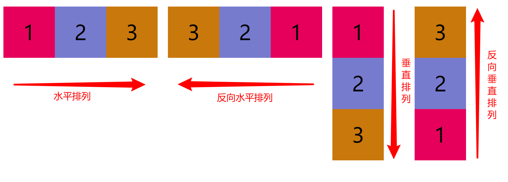
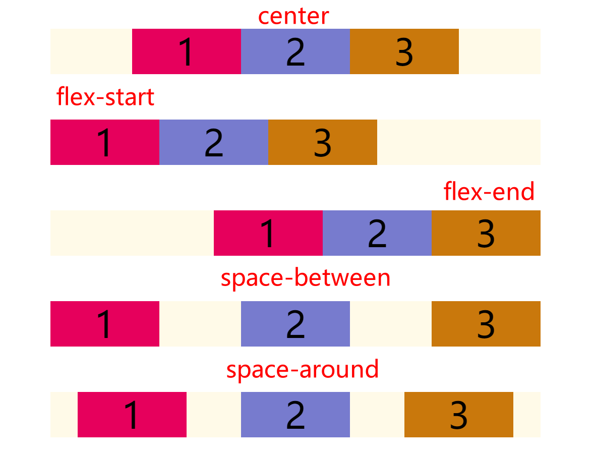
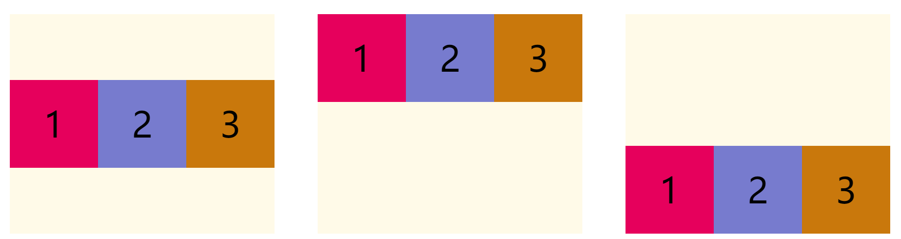
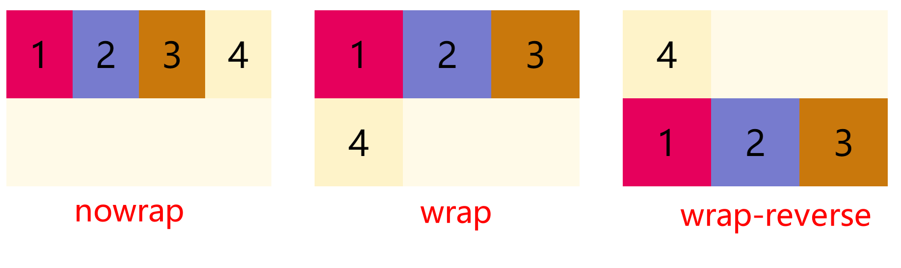
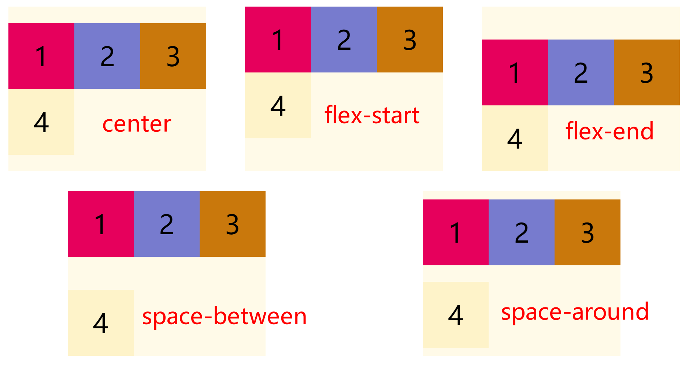
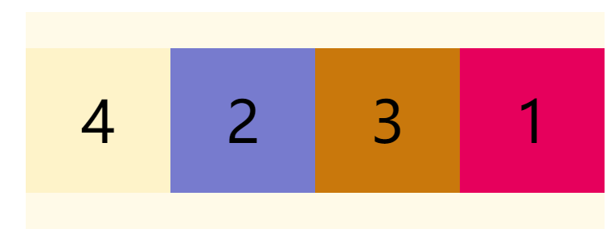
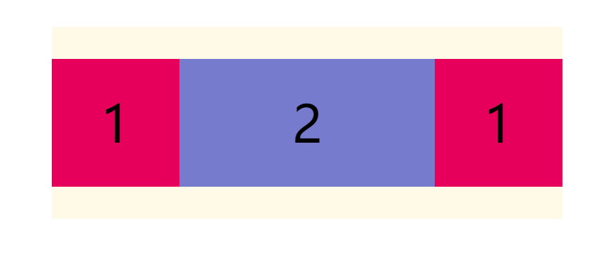
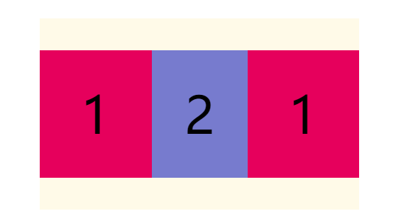
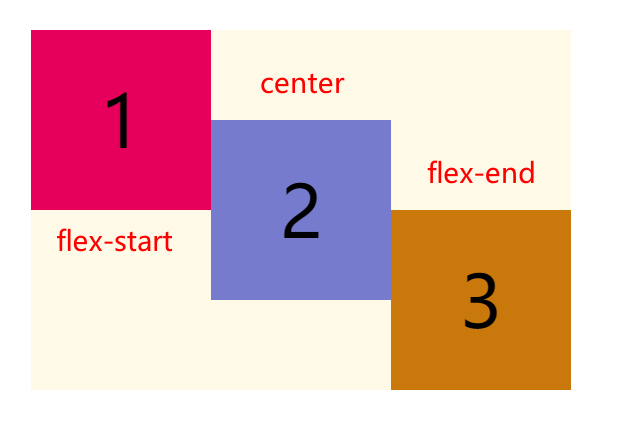

# 弹性盒子模型

## 写在前面

弹性盒子模型即*FlexBox*，也就是我们常说的flex布局，现在flex布局已经是前端的主流布局方案，早就是前端必会的内容了，接下来我们一起来看一下弹性盒子模型。

## 相关概念

CSS3新增的弹性盒子模型是一个完整的模块，涉及的样式属性较多。首先，对弹性盒子模型的相关概念完成基本的了解。


- 伸缩容器(*flex container*)：包裹伸缩项目的父元素。
- 伸缩项目(*flex item*)：伸缩容器的每个子元素。
- 轴(*axis*)：每个弹性盒子模型拥有两个轴。
	- 主轴(*main axis*)：伸缩项目沿其一次排列的轴被称为主轴。
	- 侧轴(*cross axis*)：垂直于主轴的轴被称为侧轴。
	- 方向(*direction*)：伸缩容器的主轴由主轴起点和主轴终点，侧轴由侧轴起点和侧轴终点描述伸缩项目排列的方向。
- 尺寸(*dimension*)：根据伸缩容器的主轴和侧轴，伸缩项目的宽度和高度。
	- 对应主轴的称为主轴尺寸。
	- 对应侧轴的称为侧轴尺寸。

## 定义弹性盒子模型

CSS3中想要设置为弹性盒子模型的话，需要通过`display`样式属性设置值为`flex`或`inline-flex`即可。

```css
display: flex; /* 值 flex 使弹性容器成为块级元素。 */
/* 或者 */
display: inline-flex; /* 值 inline-flex 使弹性容器成为单个不可分的行内级元素。 */
```


以上代码就可以指定某个元素为弹性盒子模型，该元素成为伸缩容器，子元素则成为伸缩项目。


> 值得注意的是如果需要兼容老版本浏览器，需要增加浏览器厂商的前缀。


以下代码定义了一个简单的弹性盒子：

`html`

```HTML
<body>
  <!-- HTML 结构为父子级结构 -->
  <div class="container">
    <div class="item1 item">1</div>
    <div class="item2 item">2</div>
    <div class="item3 item">3</div>
  </div>
</body>
```


`css`

```CSS
.container {
  display: flex;/* 忽略基本样式 */
}
```


效果如下：


默认情况下，所有子元素作为伸缩项目都是沿着主轴水平排列。

## 与容器有关的属性

### flex-direction属性

CSS中的`flex-direction`属性指定了内部元素是如何在flex容器中布局的，定义了主轴的方向(正方向或反方向)。语法结构如下：

```CSS
flex-direction: row | row-reverse | column | column-reverse;
```


- `row`：默认值，`flex`容器的主轴被定义为与文本方向相同。主轴起点和主轴终点与内容方向相同(起点在左端)。
- `row-reverse`：表现和`row`相同，但是置换了主轴起点和主轴终点(起点在右端)
- `column`：`flex`容器的主轴和块轴相同。主轴起点与主轴终点和书写模式的前后点相同(起点在上沿)
- `column-reverse`：表现和`column`相同，但是置换了主轴起点和主轴终点明(起点在下沿)

如下代码展示了各个值的情况：

```CSS
.row {
  /* 默认，水平排列 */
  flex-direction: row;
  height: 200px;
}
.row-reverse {
  /* 水平排列，反向 */
  flex-direction: row-reverse;
  height: 200px;
}
.column {
  /* 垂直排列 */
  flex-direction: column;
  margin-right: 100px;
}
.column-reverse {
  /* 垂直排列 反向 */
  flex-direction: column-reverse;
}
```


代码运行效果如下所示：



### justify-content属性

CSS中的`justify-content`属性适用于伸缩容器元素，用于设置伸缩项目沿着**主轴线的对齐方式**。

语法结构如下：

```css
justify-content: center| flex-start| flex-end| space-between| space-around;
```


- `center`：伸缩项目向第一行的中间位置对齐(居中)。
- `flex-start`：伸缩项目向第一行的开始位置对齐(左对齐)。
- `flex-end`：伸缩项目向第一行的结束位置对齐(右对齐)。
- `space-between`：伸缩项目会平均分布在一行中(两端对齐，项目之间的间隔都相等)。
- `space-around`：伸缩项目会平均分布在一行中(两端对齐，项目两侧的间隔相等)。

示例代码如下所示：

```CSS
.center {
  justify-content: center; /* 居中 */
}
.start {
  justify-content: flex-start; /* 左对齐 */
}
.end {
  justify-content: flex-end; /* 右对齐 */
}
.between {
  justify-content: space-between; /* 两端对齐，项目之间的间隔都相等 */
}
.around {
  justify-content: space-around; /* 两端对齐，项目两侧的间隔相等 */
}
```




**值得注意的是**，实现的是伸缩项目相对于伸缩容器的对齐方式，与页面无关

### align-items属性

CSS中的`align-items`属性适用于伸缩容器元素，用于设置伸缩项目所在行沿着**侧轴线的对齐方式**。

语法结构如下：

```css
align-items: center | flex-start| flex-end| baseline| stretch;
```


- `center`：伸缩项目向侧轴的中间位置对齐。
- `flex-start`：伸缩项目向侧轴的起点位置对齐。
- `flex-end`：伸缩项目向侧轴的终点位置对齐。
- `baseline`：伸缩项目根据伸缩项目的基线对齐。
- `stretch`：默认值，伸缩项目拉伸填充整个伸缩容器。

示例代码如下所示：

```CSS
.center {
  align-items: center; /* 居中 */
}
.start {
  align-items: flex-start; /* 顶对齐 */
}
.end {
  align-items: flex-end; /* 底对齐 */
}
```


运行效果如下所示：



配合`justify-content`属性，可以做出水平垂直居中

### flex-wrap属性

CSS中的`flex-wrap`属性适用于伸缩容器元素，用于**设置**伸缩容器的**子元素是单行显示还是多行显示**。

语法结构如下：

```css
flex-wrap: nowrap| wrap| wrap-reverse
```


- `nowrap`：设置伸缩项目单行显示。这种方式可能导致溢出伸缩容器
- `wrap`：设置伸缩项目多行显示，第一行在上方。
- `wrap-reverse`：与`wrap`相反，第一行在下方。

示例代码如下所示：

```CSS
.nowrap {
  /* 单行显示 */
  flex-wrap: nowrap;
}
.wrap {
  /* 多行 */
  flex-wrap: wrap;
}
.wrap-reverse {
  /* 多行，反向 */
  flex-wrap: wrap-reverse;
}
```




如果设置伸缩容器的宽度小于所有子元素宽度之和的话，子元素并没有自动换行也没有溢出；效果根据伸缩容器的宽度自动调整所有子元素的宽度。

### align-content属性

CSS中的`align-content`属性适用于伸缩容器元素，用于设置**伸缩行**的对齐方式。该属性会更改`flex-wrap`属性的效果。

语法结构如下：

```css
align-content: center| flex-start| flex-end| space-between| space-around| stretch;
```


- `center`：各行向伸缩容器的中间位置对齐。
- `flex-start`：各行向伸缩容器的起点位置对齐。
- `flex-end`：各行向伸缩容器的终点位置对齐。
- `space-between`：各行会平均分布在一行中。
- `space-around`：各行会平均分布在一行中，两端保留一半的空间。
- `stretch`：默认值，各行将会伸展以占用额外的空间。

值得注意的是**该属性对单行弹性盒子模型无效。**

示例代码如下：

```CSS
.center {
  align-content: center; /* 居中 */
}
.start {
  align-content: flex-start; /* 顶对齐 */
}
.end {
  align-content: flex-end; /* 底对齐 */
}
.between {
  align-content: space-between; /* 两端对齐，项目之间的间隔都相等 */
}
.around {
  align-content: space-around; /* 两端对齐，项目两侧的间隔相等 */
}
```




**值得注意的是**该属性对单行弹性盒子模型无效，即：带有`flex-wrap: nowrap`

### flex-flow属性

CSS中的`flex-flow`属性适用于伸缩容器元素，该属性是`flex-direction`和`flex-wrap`的简写属性，默认值为`row nowrap`。

语法结构如下：

```css
flex-flow: <'flex-direction'> || <'flex-wrap'>
```


## 与伸缩项有关的属性

### order属性

CSS中的`order`属性规定了弹性容器中的可伸缩项目在布局时的顺序。元素按照`order`属性的值的增序进行布局。拥有相同`order`属性值的元素按照它们在源代码中出现的顺序进行布局。

语法结构

```css
.item {
  order: <integer>
}
```


**属性值**

- `<integer>`：表示此可伸缩项目所在的次序组，默认为0。

值得注意的是，`order`仅仅对元素的视觉顺序产生作用，并不会影响元素的逻辑顺序。

示例代码如下：

```CSS
.item1 { order: 2; }
.item4 { order: -1; }
```




### flex-grow属性

`flex-grow`属性规定在相同的容器中，项目相对于其余弹性项目的增长量，值默认为0；语法结构如下：

```css
.item {
  flex-grow: <number>; 
}
```


示例代码如下：

```CSS
.item2 { flex-grow: 2; }
```




如果所有伸缩项目的`flex-grow`的值都为1，则它们将等分剩余空间；如果某个伸缩项目的`flex-grow`的值为2，其他为1，则前者占据的剩余空间将比其他项多一倍。

### flex-shrink属性

`flex-shrink`属性定义了项目的缩小比例，默认为1，即如果空间不足，该项目将缩小。

语法结构如下：

```css
.item {
  flex-shrink: <number>; 
```


示例代码如下：

```CSS
.item2 { flex-shrink: 2; }
```




如果所有伸缩项目的`flex-shrink`的值都为1，当空间不足时，都将等比例缩小；如果某个伸缩项目的`flex-shrink`的值为0，其他为1，则空间不足时，前者不缩小。

### flex-basis属性

`flex-basis`属性定义了在分配多余空间之前，项目在主轴方向上的初始大小。浏览器根据这个属性，计算主轴是否有多余空间。它的默认值为`auto`，即项目的本来大小。

语法结构如下：

```css
.item {
  flex-basis: <length> | auto; 
}
```


> 它可以设为跟`width`或`height`属性一样的值，例如设置`230px`，则项目将占据固定空间。


### flex属性

CSS中的`flex`属性是`flex-grow`、`flex-shrink`、`flex-basis`的简写属性，用于设置伸缩项目如何伸长或缩短以适应伸缩容器中的可用空间。语法结构如下

```css
flex: auto | initial | none | [ <'flex-grow'> <'flex-shrink'>? || <'flex-basis'> ]
```


- `none`：元素会根据自身宽高来设置尺寸。它是完全非弹性的：既不会缩短，也不会伸长来适应flex容器。相当于将属性设置为"`flex: 0 0 auto`"。
- `auto`：元素会根据自身的宽度与高度来确定尺寸，但是会伸长并吸收flex容器中额外的自由空间，也会缩短自身来适应flex容器。这相当于将属性设置为"`flex: 1 1 auto`".

`flex`属性可以指定1个、2个或3个值。

**单值语法**：值必须为以下其中之一:

- 一个无单位数(`<number>`)：它会被当作`<flex-grow>`的值。
- 一个有效的宽度(width)值：它会被当作`<flex-basis>`的值。
- 关键字`none`，`auto`或`initial`.

**双值语法**：第一个值必须为一个无单位数，并且它会被当作`<flex-grow>`的值。第二个值必须为以下之一：

- 一个无单位数：它会被当作`<flex-shrink>`的值。
- 一个有效的宽度值：它会被当作`<flex-basis>`的值。

**三值语法**:

- 第一个值必须为一个无单位数，并且它会被当作`<flex-grow>`的值。
- 第二个值必须为一个无单位数，并且它会被当作 `<flex-shrink>`的值。
- 第三个值必须为一个有效的宽度值，并且它会被当作 `<flex-basis>`的值。

### align-self属性

CSS中`align-self`属性适用于伸缩容器元素,于设置伸缩项目自身元素在侧轴的对齐方式。该属性可覆盖`align-items`属性。默认值为`auto`，表示继承父元素的`align-items`属性；语法结构如下所示：

```css
align-self: center| flex-start| flex-end| baseline| stretch;
```


- `center`：伸缩项目向侧轴的中间位置对齐。
- `flex-start`：伸缩项目向侧轴的起点位置对齐。
- `flex-end`：伸缩项目向侧轴的终点位置对齐。
- `baseline`：伸缩项目根据伸缩项目的基线对齐。
- `stretch`：默认值，伸缩项目拉伸填充整个伸缩容器。

示例代码如下：

```CSS
.start { align-self: flex-start; }
.center { align-self: center; }
.end { align-self: flex-end; }
```




## 写在最后

本篇文章到这就结束了，这里给大家推荐一个学习Flex布局的一个游戏，[Flexbox Froggy - 一个用来学CSS flexbox的游戏](https://flexboxfroggy.com/#zh-cn)，挺有意思的，练习flex布局可以试试。

这是【[从头学前端](https://juejin.cn/column/6991485674788487205)】系列文章的第五十七篇-《弹性盒子模型》，如果你喜欢这个专栏，可以给我或者专栏一个关注~

> 本系列文章在掘金首发，编写不易转载请获得允许


