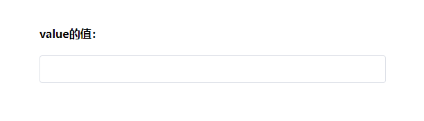
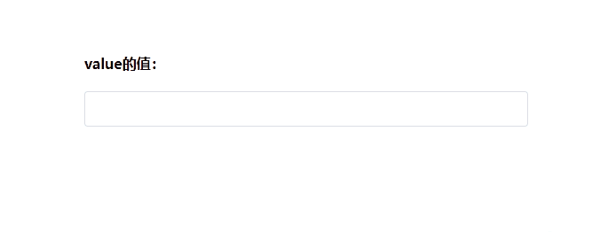
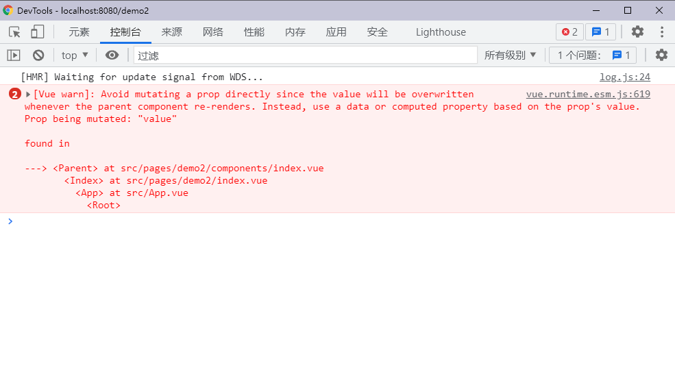
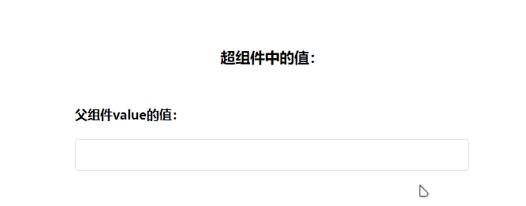
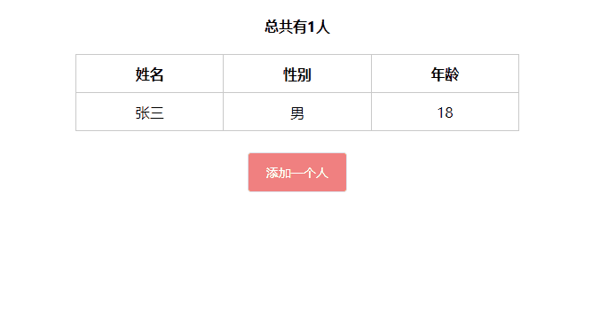

# 关于v-model语法糖的知识点，这次应该说全了

## 写在前面

Vue中实现双向数据绑定的`v-model`，如果你还停留在用的层面，那你就真的out了，现在通过这篇文章来看一下`v-model`的实现原理是什么，以及在实际开发中如何使用这个语法糖。

## v-model的使用原理

在Vue中，我们可以使用`v-bind`实现单项的数据绑定，也就是通过**父组件向子组件传入数据** ，但是反过来，**子组件不可以修改父组件传递过来的数据** ，这也就是所谓的单向数据绑定。

而`v-model`就实现了双向数据绑定，实际上它就是通过Vue提供的事件机制。即在子组件通过`$emit()`触发一个事件，在父组件使用`v-on`来监听对应的事件并修改相应的数据。

在Vue中将上面的处理简化为一个语法糖，即：

```html
<input type="text" v-model="name">

```


它的本质上是

```html
<input type="text" :value="name" @input="name = $event.target.value">

```


但是由于HTML中的表单元素的属性不一定都是`value`，也不一定触发的都是`input`事件。因此，Vue为这些元素做了单独的适配，就比如单选框、多选框和下拉菜单等。这些会使用`change`事件，对应的属性也会发生改变。

其实只要记住，Vue内部的`v-model`是完成**事件绑定** 和**事件监听** 的语法糖就够了。

## 在组件中使用v-model

我们在前面了解了Vue中的`v-model`，现在我们如果想要在`v-model`中实现`v-model`只需要在**父组件中进行数据绑定，在子组件中触发事件后并修改对应数据即可** 。

现在我们就来模拟两种`v-model`的实现

### 结合Vue语法

既然是结合Vue的语法来使用`v-model`，首先我们知道了，Vue会**默认绑定** `value`**属性和监听** `input`**事件** 。所以我们就可以在子组件中将我们的代码与Vue特性结合就可以双向数据绑定。

首先我们有一个父组件，它的代码如下：

```HTML
<template>
  <div class="container">
    <h4>{{ "value的值：" + value }}</h4>
    <!-- 使用组件 -->
    <Parent v-model="value"></Parent>
  </div>
</template>

<script>
// 引入组件
import Parent from './components/index'
export default {
  // 注册组件
  components: {
    Parent
  },
  data () {
    return {
      value: ''
    }
  },
}
</script>

<style>
.container {
  width: 500px;
  margin: 100px auto 0;
}
</style>
```


现在我们通过`<div>`和HTML提供的`contenteditable`属性来自己DIY一个输入框组件，它的代码如下：

```html
<template>
  <div class="input" contenteditable></div>
</template>

<script>
export default {

}
</script>

<style>
.input {
  box-sizing: border-box;
  width: 100%;
  height: 40px;
  line-height: 40px;
  outline: none;
  padding: 0 15px;
  border: 1px solid #dcdfe6;
  border-radius: 4px;
  color: #606266;
  background-color: #fff;
  transition: border-color 0.2s cubic-bezier(0.645, 0.045, 0.355, 1);
}
.input:focus {
  border-color: lightskyblue;
}
</style>
```


运行效果如下所示：



现在我们就通过改造上面的代码来实现双向数据绑定：

```html
<template>
  <!-- 2. 监听 input 事件的出发 -->
  <div class="input" contenteditable @input="input"></div>
</template>

<script>
export default {
  // 1. 接受父级传递的值
  props: {
    value: {
      type: String,
      default: ''
    }
  },
  methods: {
    // 3. 编写 input 事件触发执行的事件处理函数
    input (event) {
      // 4. $emit input 事件，并将 event.target.innerText 作为参数
      this.$emit('input', event.target.innerText)
    }
  },

}
</script>
```


> CSS样式部分不动


最终的运行效果如下：



现在我们就实现了一个自定义的组件中的`v-model`语法糖。

### 使用model选项

我们使用上面那种方式也不是不可以，但是很显然并不是最理想的，因为我们想要实现`v-model`的字段不一定是`value`，所以现在我们需要实现一个自定义属性的`v-model`。

现在我们假设不是使用的`value`属性和`input`事件，而是使用`string`属性和`strChange`事件。

我们引入一下Vue官方文档中的描述

> 允许一个自定义组件在使用`v-model`时定制prop和event。默认情况下，一个组件上的`v-model`会把`value`用作prop且把`input`用作event，但是一些输入类型比如单选框和复选框按钮可能想使用`value` prop来达到不同的目的。使用`model`选项可以回避这些情况产生的冲突。
原链接：[API — Vue.js (vuejs.org)](https://cn.vuejs.org/v2/api/#model)


既然我们知道了这个选项的用处，现在我们来改写一下这个代码：

```html
<template>
  <!-- 3. 监听 input 事件的出发 -->
  <div class="input" contenteditable @input="input"></div>
</template>

<script>
export default {
  // 1. 接受父级传递的值
  props: {
    string: {
      type: String,
      default: ''
    }
  },
  // 2. 配置 model 选项
  model: {
    prop: 'string',
    event: 'strChange'
  },
  methods: {
    // 4. 编写 input 事件触发执行的事件处理函数
    input (event) {
      // 5. $emit strChange 事件，并将 event.target.innerText 作为参数
      this.$emit('strChange', event.target.innerText)
    }
  },

}
```


使用model选项实现`v-model`也就结束了。

## 在多层组件中使用v-model

有时我们在项目开发中，可能存在组件嵌套组件的情况。假如我们现在有超组件、父组件、子组件。我们想要实现通过`v-model`来将超组件的值传递到父组件在传递到子组件，并实现双向数据绑定。

通过上面的实现，实现方案如下：

超组件代码

```html
<template>
  <div style="padding-top: 80px">
    <h3 style="text-align: center">{{ "超组件中的值：" + value }}</h3>
    <Parent v-model="value"></Parent>
  </div>
</template>

<script>
import Parent from './components/index.vue'
export default {
  components: {
    Parent
  },
  data () {
    return {
      value: ''
    }
  }
}
</script>

<style>
</style>
```


父组件的代码

```html
<template>
  <div class="container">
    <h4>{{ "父组件value的值：" + value }}</h4>
    <Parent v-model="value"></Parent>
  </div>
</template>

<script>
import Parent from './child/index'
export default {
  components: {
    Parent
  },
  props: {
    value: {
      type: String,
      default: ''
    }
  },
}
</script>

<style>
.container {
  width: 500px;
  margin: 50px auto 0;
}
</style>
```


子组件的代码

```html
<template>
  <!-- 2. 监听 input 事件的出发 -->
  <div class="input" contenteditable @input="input"></div>
</template>

<script>
export default {
  // 1. 接受父级传递的值
  props: {
    string: {
      type: String,
      default: ''
    }
  },
  methods: {
    // 3. 编写 input 事件触发执行的事件处理函数
    input (event) {
      // 4. $emit input 事件，并将 event.target.innerText 作为参数
      this.$emit('input', event.target.innerText)
    }
  },

}
</script>

<style>
.input {
  box-sizing: border-box;
  width: 100%;
  height: 40px;
  line-height: 40px;
  outline: none;
  padding: 0 15px;
  border: 1px solid #dcdfe6;
  border-radius: 4px;
  color: #606266;
  background-color: #fff;
  transition: border-color 0.2s cubic-bezier(0.645, 0.045, 0.355, 1);
}
.input:focus {
  border-color: lightskyblue;
}
</style>
```


现在当我们在输入框中输入值会实现三个组件的数据绑定吗？答案是不会的。不仅不会，而且还会抛出异常，如下图



报错的大概意思就是我们**违反了Vue的设计原理，不应该直接在子组件修改父组件的值** 。

解决这个问题的方法有很多种，这里介绍一个比较通用且易读的方法。就是通过计算属性来监听值的改变，然后来修改对应的值。

现在我们来修改一下父组件的代码：

```html
<template>
  <div class="container">
    <h4>{{ "父组件value的值：" + value }}</h4>
    <!-- 使用计算属性作为传递的属性 -->
    <Parent v-model="newValue"></Parent>
  </div>
</template>

<script>
import Parent from './child/index'
export default {
  components: {
    Parent
  },
  props: {
    value: {
      type: String,
      default: ''
    }
  },
  computed: {
    // 定义一个过渡的计算属性
    newValue: {
      get () {
        return this.value
      },
      set (newVal) {
        this.$emit('input', newVal)
      }
    }
  }
}
</script>

<style>
.container {
  width: 500px;
  margin: 50px auto 0;
}
</style>
```


修改后的代码运行结果如下：



到这为止我们就实现了在多层组件中使用`v-model`。

## v-model的其他细节

### v-model的数据类型

Vue中的`v-model`的**数据类型不仅仅是一个字符串，它可以是JavaScript中支持的任意类型** ，示例代码如下：

父组件代码：

```html
<template>
  <div class="container">
    <h4 style="text-align: center">{{ "总共有" + array.length + "人" }}</h4>
    <!-- 使用组件 -->
    <Parent v-model="array"></Parent>
  </div>
</template>

<script>
import Parent from './components/index'
export default {
  components: {
    Parent
  },
  data () {
    return {
      array: [
        {
          name: '张三',
          sex: '男',
          age: '18'
        }
      ]
    }
  },
}
</script>

<style>
.container {
  width: 500px;
  margin: 100px auto 0;
}
</style>
```


我们这里需要将`array`这个数组实现双向数据绑定。

子组件代码：

```html
<template>
  <div>
    <table>
      <tr>
        <th>姓名</th>
        <th>性别</th>
        <th>年龄</th>
      </tr>
      <tr v-for="(item, index) in array" :key="index">
        <td>{{ item.name }}</td>
        <td>{{ item.sex }}</td>
        <td>{{ item.age }}</td>
      </tr>
    </table>
    <button @click="handleClick">添加一个人</button>
  </div>
</template>

<script>
export default {
  props: {
    array: {
      type: Array,
      default: null
    }
  },
  model: {
    prop: 'array',
    event: 'change'
  },
  methods: {
    handleClick () {
      let arr = this.array
      arr.push({
        name: '张三',
        sex: '男',
        age: '18'
      })
      this.$emit('change', arr)
    }
  },

}
</script>

<style>
/* 样式省略 */
</style>
```


代码运行结果如下所示：



通过这个demo我们可以看到，任何数据类型都可以实现`v-model`的语法糖。

### 修饰符

Vue为`v-model`指令提供了三个修饰符，具体如下：

-  [.lazy](https://cn.vuejs.org/v2/guide/forms.html#lazy)：取代`input`监听`change`事件

-  [.number](https://cn.vuejs.org/v2/guide/forms.html#number)：输入字符串转为有效的数字

-  [.trim](https://cn.vuejs.org/v2/guide/forms.html#trim)：输入首尾空格过滤

具体可以参考Vue官网

## 写在最后

上述内容仅限于Vue2的版本中。

关于`v-model`的内容就介绍这么多，欢迎各位点赞留言+指正。

