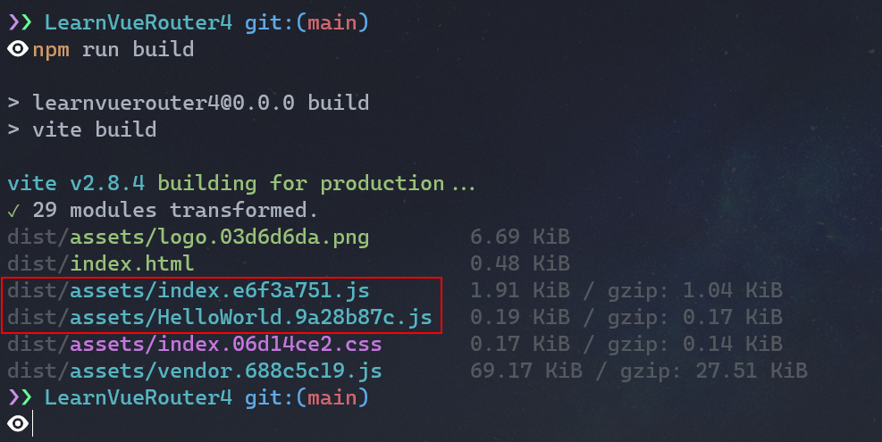

# VueRouter4快速上手

## 写在前面

Vue Router是Vue团队的研发的一款与Vue.js核心深度集成的一款路由插件，使Vue构建单页面程序变得非常的简单；Vue Router目前最新版本是4.X，也是Vue3推荐使用的版本，这篇文章我们就来学习一下Vue Router4.X。

## URL.hash与History

Vue Router中存在两种`history`（记录历史路由），分别是`URL.hash`和HTML5中提供的[`History`](https://developer.mozilla.org/zh-CN/docs/Web/API/History)两种。

hash历史记录对于没有主机的Web应用程序（例如`file://`），或当配置服务器不能处理任意的URL时非常有用，但是hash的SEO非常差劲；

History历史是HTML5中新增的，对于IE来说不是很友好，但是Vue3都放弃IE了，你也就不用考虑IE了；这种方式是目前最常见的一种方式，但是应用程序必须通过http协议被提供服务。

## 安装与使用流程

首先我们安装Vue Router，命令如下：

```Bash
npm i vue-router
```


然后在`main.js`中写入如下代码：

```JavaScript
import { createApp } from 'vue'
import App from './App.vue'
// 1 引入 createRouter
import { createRouter, createWebHistory } from 'vue-router'
// 2 定义路由映射表
const routes = [
  /* more router */
]
// 3 创建路由实例，并传递对应配置
const router = createRouter({
  // history 模式 这里使用createWebHistory
  history: createWebHistory(),
  // 传递路由映射表
  routes
})
createApp(App).use(router).mount('#app')

```


上面的代码中的`routes`如果多的话，可以定义一个`router.js`文件，将其进行抽离，示例代码如下：

`router.js`

```JavaScript
export default [
  /* more router */
]

```


`main.js`

```JavaScript
import { createApp } from 'vue'
import App from './App.vue'
// 2 引入路由映射表
import routes from './router'

// 1 引入 createRouter
import { createRouter, createWebHistory } from 'vue-router'
// 3 创建路由实例，并传递对应配置
const router = createRouter({
  // history 模式 这里使用createWebHistory
  history: createWebHistory(),
  // 传递路由映射表
  routes
})
createApp(App).use(router).mount('#app')

```


或者**直接在****`router.js`****中直接导出一个路由实例，在****`main.js`****中使用即可**（这种方式更常用）。

## router-link和router-view

### router-link

`<router-link>`是Vue提供的自定义组件，用于创建链接，在Vue中并没有使用原生的`<a>`，因为`<a>`改变URL后会重新加载页面而`<router-link>`不会；关于`<router-link>`组件的细节支持哪些属性，可以参考[文档](https://router.vuejs.org/zh/api/#router-link-props)。

### router-view

`<router-view>`组件用于与URL对应的组件，例如下面这段代码：

```HTML
<template>
  <router-link to="/hello"
    ></router-link>
  <router-view></router-view>
</template>
```


然后我们的`router.js`的代码如下：

```JavaScript
import RootComponent from './components/root.vue'
export default [
  {
    path: '/',
    // 引入组件
    component: RootComponent
  },
  {
    path: '/hello',
    // 路由懒加载引入组件
    component: () => import('./components/HelloWorld.vue')
  }
]

```


关于其他配置项，可以参考[文档](https://router.vuejs.org/zh/api/#routerecordraw)。

代码运行结果如下所示：


## 路由懒加载

当我们的应用越来越大时，打包后的JavaScript代码也会特别的大，这个时候需要我们将整个应用拆分为不同的块，而Vue Router就支持这个功能，我们只需要**使用动态导入替换静态导入即可**，就比如上面那段代码：

```JavaScript
component: () => import('./components/HelloWorld.vue')
```


然后打包（webpack、Vite）工具就会将这些动态导入的组件单独打包，如下图所示：



## 动态路由

VueRouter允许我们动态的去设置路由匹配规则，例如我们现在有一个`User`组件，组件的内容会根据不同的ID展示不同的内容，设置方法只需要通过`:参数名`的形式去设置即可。

例如：

```JavaScript
{
  path: '/user/:id',
  component: () => import('@/components/User')
}
```


在模板中跳转如下：

```HTML
<router-link to="/user/10010"></router-link>
```


或者通过`useRouter`这个hook提供的`push`方法，例如：

```JavaScript
import { useRouter } from 'vue-router'
const {push} = useRouter()
push({
  path: '/user',
  params: { id: 10010 }
})
// 或者
let id = 10010
push('/user/' + id)
```


获取路由地址可以通过`useRoute`这个hook，用法与`useRouter`一致。

### 匹配所有路由

VueRouter的动态路由允许我们匹配哪些没有匹配到的路由，示例代码如下：

```JavaScript
{
  path: '/:pathMatch(.*)',
  component: () => import('./components/Page404.vue'),
},
```


当前面的路由匹配未成功时，就会匹配这个路由。

## 路由嵌套

现在我们有一个需求，就是在`HelloWorld`组件下存两个组件，需要切换着两个组件。

这个时候路由嵌套的就发挥作用了，其实路由嵌套比较简单，就是通过路由配置中的一个`children`属性来实现，示例代码如下：

`HelloWorld.vue`

```JavaScript
<template>
  <h1>Hello World</h1>
  <div
    style="
      display: flex;
      justify-content: space-between;
      width: 240px;
      margin: 0 auto;
    "
  >
    <router-link to="about">about</router-link>
    <router-link to="user">user</router-link>
  </div>
  <router-view></router-view>
</template>

```


`router.js`

```JavaScript
{
  path: '/hello',
  // 路由懒加载引入组件
  component: () => import('./components/HelloWorld.vue'),
  children: [
    {
      path: 'about',
      component: () => import('./components/about.vue'),
    },
    {
      path: 'user',
      component: () => import('./components/user.vue'),
    },
  ],
},
```


子组件比较简单，只有一个`<h1>`标签，最终效果如下：


## 写在最后

这篇文章到这就结束了，总的来说比较简单没有什么太深入的东西，比较适合入门。

