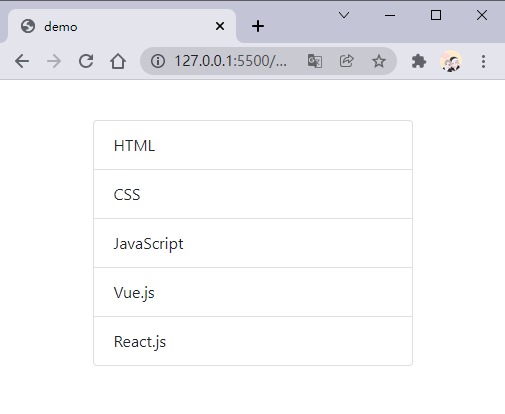

# 从:key的角度，来看Vue3中diff算法的实现原理。

## 写在前面

在我们使用`v-for`指令的时候，尤大大建议我们为每一项都添加一个唯一的属性`key`，在Vue文档中是这么说的：

> *为了给Vue一个提示，以便它能跟踪每个节点的身份，从而重用和重新排序现有元素，你需要为每项提供一个唯一的**`key`**attribute，除非遍历输出的 DOM 内容非常简单。*


看到这，是不是会有以下疑问：

- 为什么要添加一个唯一的`key`？
- 为什么不建议用索引作为唯一的`key`？
- 为什么不能使用随机数作为唯一的`key`？

接下来我们依次回答这些问题。

## key是什么

在文档中对`key`属性，解释是这样的：

- `key`属性主要用在Vue的虚拟DOM算法提示，在对比新旧nodes时辨识VNodes；
- 如果不使用`key`，Vue会使用一种算法最小化元素的移动并且尽可能的尝试就地修改/复用相同类型元素；
- 而使用`key`时，它会基于`key`的变化重新排列元素顺序，并且会移除/销毁key不存在的元素。

看了这些内容就更加的懵了，又出现了新的问题：

- 什么是Vnode？
- 什么是虚拟DOM？
- 没有`key`的时候，如何尝试修改和复用的？
- 有`key`的时候，如何基于`key`重写排列？

我们接着看。

## 虚拟DOM

### VNode

首先我们先来看一下VNode。VNode即*Virtual Node*，也就是虚拟节点，在Vue中无论是组件还是元素，最终表示出来的都是一个个VNode，VNode的本质其实就是一个JavaScript对象，例如下面这个节点：

```HTML
<div class="name" style="font-size: 3rem; color: #333;">一碗周</div>
```


它最终的VNode是这样的：

```JavaScript
const vNode = {
  type: 'div',
  props: {
    class: 'name',
    style: {
      fontSize: '3rem',
      color: '#333',
    },
  },
  children: '一碗周',
}

```


### 虚拟DOM

如果不是只有一个节点，而是有很多个节点，形成了一个VNode Tree，也就是虚拟DOM，例如下面这张图：


也就是说在Vue中写HTML代码，先会被转换为虚拟DOM，然后才会被渲染成真实DOM。

### 虚拟DOM VS 真实DOM

前面我们介绍了，Vue中渲染真实DOM一共需要三个步骤，而原生仅仅需要两个步骤，如下图：


如果单从图上看的话，毫无悬念，直接生成真实DOM的方式更快一些。

但实际上，如果某个节点的内容发生变化时，**比较虚拟DOM比直接比较真实DOM在性能上是要更优的**，这也是为什么Vue、React等框架采用虚拟DOM的原因。

上面所说的比较，就是采用的diff算法。

## 不使用key属性的处理方式

现在我们来看一下不使用key属性是何如处理的，我们找到相关的源码，在`packages\runtime-core\src\renderer.ts`中，大概1600行的位置，这里面表明了存在`key`和不存在`key`分别调用哪个函数，如下图：


现在我们直接定位到`patchUnkeyedChildren()`方法，看看在这个方法中做了些什么，如下图：


如果只看图不理解的话，咱们举一个例子，代码如下：

```HTML
<body>
  <div id="app"></div>
  <template id="my-app">
    <ul class="list-group">
      <li class="list-group-item" v-for="item in list">{{item.name}}</li>
    </ul>
  </template>
  <script src="https://unpkg.com/vue@next"></script>
  <script>
    Vue.createApp({
      template: '#my-app',
      data() {
        return {
          list: [
            { id: 0, name: 'HTML' },
            { id: 1, name: 'CSS' },
            { id: 2, name: 'JavaScript' },
            { id: 3, name: 'Vue.js' },
            { id: 4, name: 'React.js' },
          ],
        }
      },
    }).mount('#app')
  </script>
</body>
```


运行结果如下：



现在我们在Vue.js前面插入一个`{id: 5, name: 'Ajax'}`，其新旧虚拟DOM如下图所示：


执行过程如下：


如果`old VDOM`比`new VDOM`多的化，多余的部分直接卸载。

## 使用key属性的处理

使用`key`属性的处理方式是这篇文章的**重头戏**，我们首先看一下`patchKeyedChildren()`方法做了些什么，如下图：


我们可以看到，这个方法比较长，但是它分为5个步骤，我们依次来看：

> tips：开发Vue框架的大佬都写注释，你还觉着不需要写注释吗？？？？


我们依次来看，第一步，从头开始遍历，主要内容如下图：


我们举个例子：


首先`key`为`0`的比较，发现一致，继续比较，直到`key`为`3`与`key`为`5`的比较，不一致直接跳出这个`while`循环。

第二步的操作与第一步基本一致，只不过就是从尾部开始，主要内容如下：


例子：


第三步和第四步，分别是添加新节点或者移除旧节点，主要代码如下：


例子：


最后一步，也就是最复杂的异常，这个是用于处理中间的乱序，或者移动新增等问题，例子如下：


所以我们可以发现，Vue在进行diff算法的时候，会尽量利用`key`来优化操作，所以说`key`属性是必须的。

## 为什么不能使用索引作为key

如果我们是使用`index`作为`key`，假如有下面这个数组：

```JavaScript
list: [
  {name: 'HTML'},
  {name: 'CSS'},
  {name: 'JS'},
]
```


我们在最前面添加一项：

```JavaScript
list.unshift({name: '一碗周'})
```


如果使用索引做`key`的话，会出现下面这种问题：


所以说我们尽量要使用唯一的且不变的值作为`key`。

注意：**千万不要使用随机数作为****`key`****，不然每次比较都不相同**。

## 写在最后

以上就是这篇文章的全部内容，如果那里有错误，欢迎指正；如果帮助到你，可以帮我点个赞支持一下，毕竟画图不易~

最后下面这几篇文章是我参加掘金征文活动的，可以看看下，没准有不一样的收货呢。

