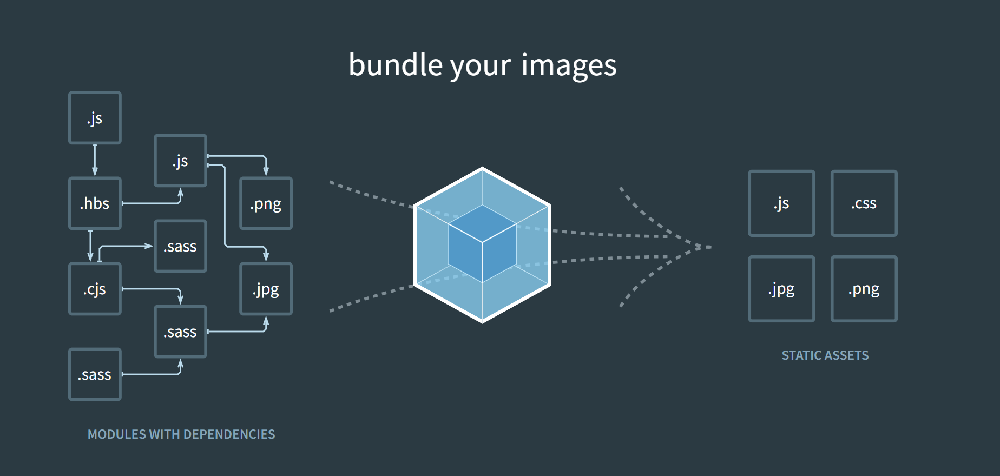
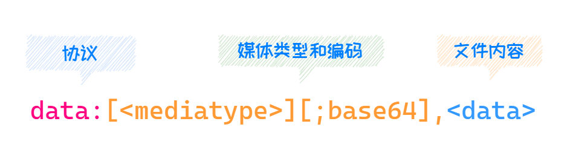
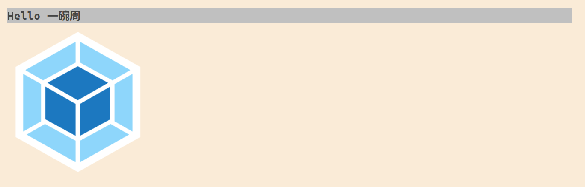
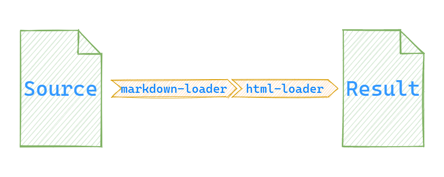
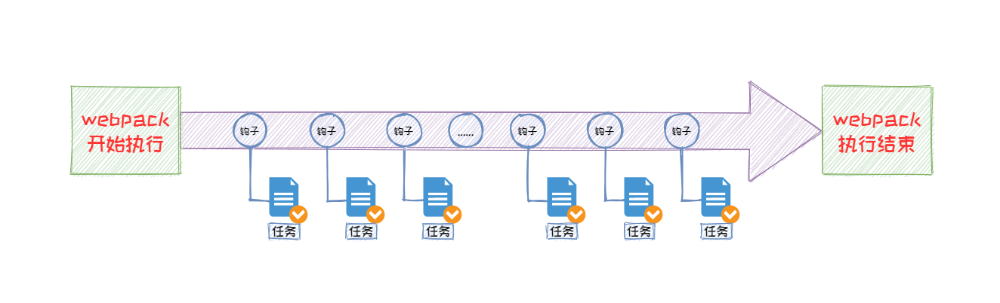
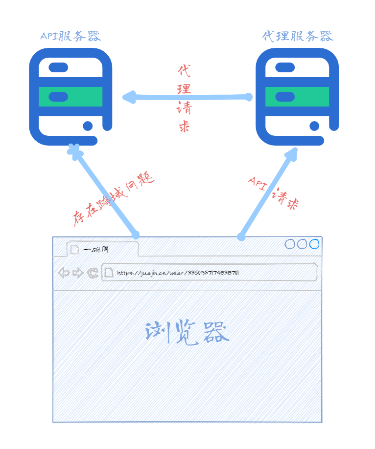

# webpack

## 概述

webpack是一个现代的打包模块化的JavaScript工具，在webpack中一切文件皆模块，在内部通过Loader转换文件，通过Plugin注入钩子，最后输出由多个模块组合成的文件。



上图是webpack官网的截图，可以看出，对于webpack来说，JavaScript、CSS、SCSS、图片等所有文件，全部作为模块来使用，这些模块经过webpack处理后，最终会输出为浏览器可以使用的资源。

webpack的优点如下：

- 社区庞大且活跃，在前端发展速度如此快的今天，可以很快找到最新的Plugin；
- 使用场景不限于Web开发；
- 具有一个良好的开发体验；

## webpack初体验

### 快速上手

webpack属于一个npm工具模块，所以在安装之前，需要初始化npm，然后安装`webpack`和`webpack-cli`，命令如下：

```PowerShell
npm init -y
npm i webpack webpack-cli -D
```


webpack自4.0以后，0配置也可以进行使用直接使用webpack，这里我们的项目目录结构如下：

```纯文本
.
├── src
│   ├── module.js
│   └── index.js
├── index.html
└── package.json
```


目录中的代码如下：

`src/module.js`

```JavaScript
export default () => {
  // 创建一个DOM元素
  const element = document.createElement('h2')

  element.textContent = 'Hello 一碗周'
  element.addEventListener('click', () => {
    alert('Hello webpack')
  })

  return element
}

```


`src/index.js`

```JavaScript
import createTitle from './module.js'

const title = createTitle()

document.body.append(title)

```


`index.html`

```HTML
<!DOCTYPE html>
<html lang="en">

<head>
  <meta charset="UTF-8">
  <meta http-equiv="X-UA-Compatible"
        content="IE=edge">
  <meta name="viewport"
        content="width=device-width, initial-scale=1.0">
  <title>webpack快速上手</title>
</head>

<body>
  <script type="module"
          src="./src/index.js"></script>
</body>

</html>
```


然后执行如下命令：

```PowerShell
npx webpack
```


最终可以看到根目录下出现了一个`dist`目录，目录下有个`main.js`文件，文件内容如下：

```JavaScript
(()=>{"use strict";const e=(()=>{const e=document.createElement("h2");return e.textContent="Hello 一碗周",e.addEventListener("click",(()=>{alert("Hello webpack")})),e})();document.body.append(e)})();
```


现在我们可以先改一下`index.html`中的`<script>`标签的引用地址，代码如下：

```JavaScript
<script type="module"
        src="./dist/main.js"></script>
```


然后可以看一下效果，与之前是否一致。

### 配置文件

自从webpack4开始，webpack支持0配置的方式，它的默认入口文件是`src/index.js`，默认出口文件是`dist/main.js`，如果我们想要自定义这些内容的话，我们需要在根目录下创建一个`webpack.config.js`文件，来自定义这些配置。

`webpack.condfig.js`是运行在node下的一个js文件，所以说我们要按照CommonJS的方式来编写这个文件，该文件导出一个对象，所有的配置项作为该对象的属性出现。

示例代码如下：

```JavaScript
const path = require('path')
module.exports = {
  // 入口文件
  entry: './src/main.js',
  // 出口配置
  output: {
    // 配置出口文件名
    filename: 'index.js',
    // 文件输出目录，必须是绝对目录
    path: path.join(__dirname, 'output'),
  },
}

```


现在运行webpack，就可以按照我们的配置进行打包。

### 工作模式

webpack中的工作模式有三种，设置工作模式有两种方式，第一种是通过配置文件中提供的`mode`选项，另一种在命令行中通过`—mode`选项，具体的值分别是`'none' | 'development' | 'production'`，三种模式的区别如下：

- none：不会进行代码的优化操作，可读性最高，打包速度最快
- production：默认值，该模式会对代码进行压缩
- development：自动优化打包速度，添加一些调试过程的辅助

### 资源模块

除了js文件之外，我们还可以通过Loader加载任意类型的的资源模块，这里我们以css资源为例，首先安装这两个Loader，命令如下：

```PowerShell
npm i style-loader css-loader -D
```


然后我们在`src`目录下创建两个CSS文件，并将原本内容进行修改，代码如下：

`src/module.js`

```JavaScript
import './module.css'
export default () => {
  // 创建一个DOM元素
  const element = document.createElement('h2')

  element.textContent = 'Hello 一碗周'
  element.classList.add('title')
  element.addEventListener('click', () => {
    alert('Hello webpack')
  })

  return element
}

```


`src/main.js`

```JavaScript
import createTitle from './module.js'
import './main.css'
const title = createTitle()

document.body.append(title)

```


`src/module.css`

```JavaScript
.title {
  background-color: silver;
  color: #444;
}

```


`src/main.css`

```JavaScript
body {
  margin: 0 auto;
  width: 1200px;
  background-color: antiquewhite;
}

```


然后我们的`webpack.config.js`配置文件的信息如下：

```JavaScript
const path = require('path')
module.exports = {
  mode: 'none',
  entry: './src/main.js',
  output: {
    filename: 'index.js',
    path: path.join(__dirname, 'dist'),
    // publicPath 用于表示资源的打包后的资源前缀，默认为空
  },
  module: {
    rules: [
      {
        // 模块的匹配规则
        test: /.css$/,
        // 从后往前执行，每一项都是一个loader
        use: ['style-loader', 'css-loader'],
      },
    ],
  },
}

```


现在运行webpack即可将`src`下的4个资源打包为一个js文件。

Loader是webpack的实现整个前端模块化的核心，通过加载不同的loader，从而可以实现任意类型资源的加载。

### url-loader

`url-loader`可以让指定文件在低于指定大小时，可以让其返回一个DataURL，否则通过`file-loader`处理文件。

DataURL即前缀为`data:`协议的URL，其允许内容创建者向文档中嵌入小文件。如下图所示：



首先我们安装一下必要的npm包，命令如下：

```PowerShell
npm i url-loader file-loader -D
```


> `url-loader`一般配合`file-loader`一起使用。


现在我们通过js的方式引入一个图片，然后添加到页面中，代码如下：

`src/main.js`

```JavaScript
import createTitle from './module.js'
import './main.css'
import logo from './logo.png'
const title = createTitle()
document.body.append(title)
// 在body中插入图片
const img = new Image()
img.src = logo
document.body.append(img)

```


然后我们在配置一下`webpack.config.js`，代码如下：

```JavaScript
const path = require('path')
module.exports = {
  mode: 'none',
  entry: './src/main.js',
  output: {
    filename: 'index.js',
    path: path.join(__dirname, 'dist'),
  },
  module: {
    rules: [
      {
        // 模块的匹配规则
        test: /.css$/,
        // 从后往前执行，每一项都是一个loader
        use: ['style-loader', 'css-loader'],
      },
      {
        test: /.png$/,
        use: {
          loader: 'url-loader',
          options: {
            // 小于这个值的通过url-loader，转换为DataURL，否则使用file-loader
            limit: 10 * 1024,
          },
        },
      },
    ],
  },
}

```


然后在命令行执行如下命令：

```PowerShell
npx webpack
```


即可输出所有内容，然后去运行我们的`index.html`，即可获得如下内容：



以上就是`url-loader`的使用方式。

**何时使用DataURL，何时单独存在**？

- 对于小文件，我们可以使用DataURLs，从而减少请求次数
- 对于大文件我们可以单独进行存在，提高加载速度

### 处理ES6+

webpack仅仅是完成打包作用  ，并不会对ES6+的新特性的转换，需要我们通过一些Loader进行转换，其中最常见的就是`babel-loader`。如果使用`babel-loader`的话，还需要依赖相关的`babel`核心模块，安装命令如下：

```PowerShell
npm i babel-loader @babel/core @babel/preset-env -D
```


然后`webpack.config.js`配置信息如下：

```JavaScript
module: {
  rules: [
    {
      test: /.js$/,
      use: {
        loader: 'babel-loader',
        options: {
          presets: ['@babel/preset-env'],
        },
      },
    },
    {/* more code */},
  ],
},
```


现在我们打包后的代码就是ES5的写法。

### webpack加载资源的方式

webpack中除了支持ES Module规范引入资源，他也支持使用CommonJS规范和AMD规范，虽然它支持多种规范，但是除非必要情况，尽量不要混合使用，如何混合使用可能会导致大大降低项目的可维护性。

除了JavaScript提供的这三种方式以外，还有一些独立的Loader提供的加载也会触发资源加载，例如`css-loader`中，我们使用`@import`指令和`url()`函数，都会触发资源加载；还有就是`html-loader`中``标签的`src`属性，也会触发资源加载，除了``标签的`src`属性还有很多属性都是默认支持的。

### 开发一个Loader

Loader作为webpack的核心机制，实现原理呢也比较简单，现在我们就来开发一款属于自己的Loader。

我们开发的这个Loader，用于将Markdown语法转换为HTML代码，开发步骤如下所示：

1. 导出一个工作函数，该函数接受一个参数，参数为当前模块的输入；
2. 安装Markdown解析模块，这里使用`marked`，安装名`npm i marked -D`；
3. 最后将处理后的内容进行`return`，返回的结果最终必须是一段JavaScript代码。
	如果我们返回的内容并不是一段JavaScript代码，我们这里有两种方式进行处理，方式一就是自己编写一个将我们的结果处理为JavaScript代码的Loader，另一种就是借助现成的Loader进行处理。

核心代码如下：

`markdown-loader.js`

```JavaScript
const marked = require('marked')

// source 输入的内容，这里为 Markdown 语法
module.exports = source => {
  // 通过 marked 插件进行处理，然后将 HTML 字符串交给下一个 loader 处理
  return marked.parse(source)
}

```


webpack配置文件如下：

```JavaScript
module: {
  rules: [
    {
      test: /.md$/,
      // 除了使用文件名，也可以使用路径的方式引入 loader
      use: ['html-loader', './markdown-loader'],
    },
  ],
},
```


配置完成后我们执行`npx webpack`命令，即可完成打包。

上面的执行流程，流程图如下：



Loader就像一个管道，将输入的内容处理后输出。

## webpack插件

插件机制是webpack中除了Loader外的另一个核心特性，它的目的就是增强webpack在项目自动化方面的能力。前面我们了解到Loader就是实现各种资源的加载，从而实现模块化打包；而Plugin就是解决除了资源加载之外的其他一些的自动化的工作；就比如Plugin就可以帮助我们在打包之前清空`dist`目录。

Loader+Plugin可以帮助我们实现大多前端工程化中的工作，这就给了我们一个webpack就是前端工程化的一个错觉，实则不然。

### webpack中常用的插件

首先我们介绍一个webpack中常用的一些插件，并在项目中使用这些插件。

- [`clean-webpack-plugin`](https://www.npmjs.com/package/clean-webpack-plugin)：可以帮助我们自动情况`dist`目录的插件；
- [`html-webpack-plugin`](https://www.npmjs.com/package/html-webpack-plugin)：自动生成使用打包结果的HTML；
- [`copy-webpack-plungin`](https://www.npmjs.com/package/copy-webpack-plugin)：将已经存在的单个文件或整个目录复制到构建目录。

下面我们看一下在`webpack.config.js`如何使用这三个插件，代码如下：

```JavaScript
const path = require('path')
// 引入对应插件
const { CleanWebpackPlugin } = require('clean-webpack-plugin')
const HtmlWebpackPlugin = require('html-webpack-plugin')
const CopyWebpackPlugin = require('copy-webpack-plugin')

module.exports = {
  mode: 'none',
  entry: './src/main.js',
  output: {
    filename: 'index.js',
    path: path.join(__dirname, 'dist'),
  },
  module: {
    rules: [/* more code */],
  },
  plugins: [
    // 用于清空 dist 目录
    new CleanWebpackPlugin(),
    // 用于生成 index.html
    new HtmlWebpackPlugin({
      // 添加 title 属性，在 HTML 文件中通过 htmlWebpackPlugin.options.title 获取，采用 Lodash 模板语法书写
      title: 'Webpack Plugin Sample',
      // 添加一个 meta 元素，name 为 viewport content 为 width=device-width
      meta: {
        viewport: 'width=device-width',
      },
      // 使用哪个 HTML 文件作为模板
      template: 'index.html',
    }),
    // 生成多个页面 创建多个 HtmlWebpackPlugin 实例，用于生成 about.html
    new HtmlWebpackPlugin({
      // filename 默认为 index.html
      filename: 'about.html',
    }),
    // 拷贝不需要打包的内容
    new CopyWebpackPlugin([
      // 'public/**'
      // 直接拷贝 public 下所有内容至输出目录
      'public',
    ]),
  ],
}


```


这里用到的模板如下：

`index.html`

```HTML
<!DOCTYPE html>
<html lang="en">

<head>
  <meta charset="UTF-8">
  <meta http-equiv="X-UA-Compatible"
        content="IE=edge">
  <meta name="viewport"
        content="width=device-width, initial-scale=1.0">
  <title>Webpack</title>
</head>

<body>
  <div class="container">
    <h1>
      <!-- 使用 Lodash 模板语法可以直接使用 webpack 中的数据 -->
      <!-- htmlWebpackPlugin.options.title 是 htmlWebpackPlugin 插件提供的 -->
      <%= htmlWebpackPlugin.options.title
          %>
    </h1>
  </div>
</body>

</html>
```


这里的的模板语法采用的是[Lodash](http://lodash.think2011.net/template)提供的。

执行webpack打包后的`index.html`文件内容如下：

```HTML
<!DOCTYPE html>
<html lang="en">

<head>
  <meta charset="UTF-8">
  <meta http-equiv="X-UA-Compatible"
        content="IE=edge">
  <meta name="viewport"
        content="width=device-width, initial-scale=1.0">
  <title>Webpack</title>
<meta name="viewport" content="width=device-width"></head>

<body>
  <div class="container">
    <h1>
      <!-- 使用 Lodash 模板语法可以直接使用 webpack 中的数据 -->
      <!-- htmlWebpackPlugin.options.title 是 htmlWebpackPlugin 插件提供的 -->
      Webpack Plugin Sample
    </h1>
  </div>
<script type="text/javascript" src="index.js"></script></body>

</html>
```


除了上面介绍的插件外，webpack中还提供了成百上千的插件，我们不需要全部理解，如果有需要我们直接去Github上进行搜索即可。

### 开发一款插件

相比于Loader，Plugin的拥有更宽的能力范围，其插件机制其实就是通过钩子机制实现的。webpack在工作之中会有很多的环节，在每个环节webpack都埋下了一些钩子，方便我们利用这些钩子去执行某些任务，从而开发一款插件，如下图所示：



具体有哪些预先定义好的钩子我们可以通过webpack官方文档进行查看，跳转链接[点我](https://webpack.js.org/api/compiler-hooks/#hooks)。

webpack要求插件必须是一个函数，或者一个包含`apply`方法的一个对象。一般情况下，我们会定义一个类，这个类中包含一个`apply`的方法，然后实例化这个类进行使用。

我们现在编写一个用于清空打包后的`.js`文件中的`/**/`那些没有必要的注释的插件，实现代码如下：

`myWebpackPlugin.js`

```JavaScript
module.exports = class myWebpackPlugin {
  apply(compiler) {
    console.log('我的webpack插件开始执行')

    compiler.hooks.emit.tap('myWebpackPlugin', compilation => {
      // compilation => 可以理解为此次打包的上下文
      // 可以通过 compilation.assets 获取所有文件的对象
      for (const name in compilation.assets) {
        // 通过 for...in 语句遍历到所有的文件名
        // name // 当前文件名
        // compilation.assets[name].source() 获取该文件下所有的内容
        if (name.endsWith('.js')) {
          // 如果以 .js 文件结尾，获取内容并删除对应的注释
          const contents = compilation.assets[name].source()
          const withoutComments = contents.replace(/\/\*\*+\*\//g, '')
          // 重新将内容包装一个对象
          compilation.assets[name] = {
            source: () => withoutComments,
            // 约定包含一个 size 属性
            size: () => withoutComments.length,
          }
        }
      }
    })
  }
}

```


在webpack中引用，代码如下：

`webpack.config.js`

```JavaScript
const path = require('path')
// 引入对应插件
/* more code */
const myWebpackPlugin = require('./myWebpackPlugin')
module.exports = { /* more code */ },
  module: { /* more code */ },
  plugins: [
    /* more code */
    new myWebpackPlugin(),
  ],
}

```


执行webpack打包后就会发现打包好的`.js`代码中的无用注释就被清空了。

通过上面的那个demo我们了解到，插件就是通过往webpack生命周期中的钩子挂载函数实现的。

## 开发体验优化

经过上面的学习，我们已经对webpack有了一个初步的认识，但是如果以目前的情况是无法满足我们的开发环境的。一个舒服的开发环境肯定满足以下内容：

1. 使用HTTP服务运行我们的代码（更加接近生产环境）
2. 自动编译+自动刷新
3. 提供SourceMap支持（快速定位错误信息）

### 自动编译

webpack的自动编译只需要启动Watch模式即可，开始该模式后，webpack就会监听文件的变化，当它们发生修改后，webpack会重新打包编译。

开始Watch模式有两种方式：

1. 运行webpack时添加一个`--watch`的参数，示例如下：
	```PowerShell
	npx webapck --watch
	```
	
2. 在`webpack.config.js`中添加`watch: true`的配置，配置如下：
	```JavaScript
	module.exports = {
	  //...
	  watch: true,
	};
	Ti
	```
	

### 自动刷新浏览器

自动刷新浏览器可以通过[browser-sync](https://browsersync.io/)来完成，该工具使用也比较简单，只需要监听文件改变即可。使用步骤如下：

1. 首先安装该模块
	```PowerShell
	npm install -g browser-sync
	```
	
2. 启动该命令，并监听对应文件
	```PowerShell
	browser-sync dist --files "**/*"
	```
	

使用这种方式的缺点如下：

- 在操作上更加繁琐，因为我们需要同时启动两个命令；
- 在执行效率上有所降低，这是因为webpack打包后需要写磁盘，写完之后监听到对应文件变化后，browser-sync需要读磁盘。

由于种种问题，webpack提供了[webpack-dev-server](https://www.npmjs.com/package/webpack-dev-server)工具，接下来我们学习一下该工具。

### webpack-dev-server

该工具将**自动编译**和**自动刷新浏览器**等功能**集成在一起**，使用也比较简单，安装完成之后会提供一个cli命令，首先我们先需要安装一下这个工具，命令如下：

```PowerShell
npm i webpack-dev-server -D
```


安装完成之后直接使用如下命令即可创建一个HTTP服务，并监听文件变化自动打包和刷新浏览器，运行命令如下：

```PowerShell
npx webpack-dev-server # 或者 npx webpack server
```


启动之后，默认监听的是8080端口，访问`http://127.0.0.1:8080`即可访问我们打包后的程序。

值得注意的是，使用webpack-dev-server并不会将我们的打包结果放入磁盘中，它只是临时将打包结果放入我们的内存中，从而加快构建效率，提升我们的开发体验。

关于webpack-dev-server的配置项这里介绍两个：

#### 静态资源访问配置项

首先我们介绍一下关于静态资源访问的配置，该配置项在webpack4*和webpack5*中有所不同，具体如下：

- webpack4*中配置项为[`contentBase`](https://v4.webpack.docschina.org/configuration/dev-server/#devserver-contentbase)，它的参数可以是一个字符串也可以是数组，表示静态文件目录；
- webpack5*中配置项为[`static`](https://webpack.docschina.org/configuration/dev-server/#devserverstatic)，它的默认目录就是public，可以给他传递一个`false`，可以将其设置为禁用。

如下代码展示了webpack4*中如何处理静态资源：

`webpack.config.js`

```JSON
const path = require('path')
// 引入对应插件

module.exports = {
  /* more code */
  devServer: {
    contentBase: path.join(__dirname, 'public'),
  },
  /* more code */
  plugins: [
    /* more code */
    // 开发环境不需要每次都拷贝静态资源，只有在打包编译上线前才会编译打包
    // new CopyWebpackPlugin([
    //   // 'public/**'
    //   // 直接拷贝 public 下所有内容至输出目录
    //   'public',
    // ]),
  ],
}

```


#### 代理API配置项

目前大多数情况下，开发过程中的前端应用和后端接口是不同源的（[什么是同源策略](https://developer.mozilla.org/zh-CN/docs/Web/Security/Same-origin_policy)），导致跨域请求失败，出现这种问题的解决方法之一就是服务端接口支持CORS（跨域资源共享），但是并不是所有的API都支持CORS；如果我们前后端同源部署的情况下，后端接口也没有必要开始CORS。

除了上面介绍的那种，解决这个问题最好的办法就是配置代理服务器，将API请求为代理服务器（开发服务器），然后代理服务器在去请求真正的API服务器，如下图所示：



webpack-dev-server支持直接通过配置实现代理服务器，主要是通过`devServer.proxy`配置项实现。

demo：我们这里将[GitHubAPI](https://api/github.com)代理到本地代理服务器，配置信息如下：

```JSON
const path = require('path')
module.exports = {
  /* more code */
  devServer: {
    contentBase: path.join(__dirname, 'public'),
    proxy: {
      // 凡是以 /api 开头的接口，都会被代理
      '/api': {
        // 例如我们请求 http://localhost:8080/api/users 会被代理到 https://api.github.com/api/users
        target: 'https://api.github.com',
        // 实际上我们的真正请求地址为 https://api.github.com/users 所有我们需要通过 pathRewrite 配置项进行重写路径
        pathRewrite: { '^/api': '' },
        // 默认情况下，代理时会保留主机头的来源，可以将 changeOrigin 设置为 true 以覆盖此行为。
        changeOrigin: true,
      },
    },
  },
  /* more code */
}

```


现在我们执行如下命令启动项目

```PowerShell
npx webpack server
```


访问`http://localhost:8080/api/users`即可访问到`https://api.github.com/users`。

### Source Map

#### 概述

目前生产环境的代码都是经过打包编译之后的代码，和源代码大不相同，但是这样就会出现一个问题，那就是无法快速定位bug，影响开发效率。

Source Map可以帮助我们解决这个问题，简答的说，Source Map就是一个信息文件，里面存储的源代码和编译之后的代码的对应信息，通过Source Map可以快速帮助我们定位。

Source Map的使用比较简单，只需要在转换后的代码尾部添加一行即可

```JSON
//@ sourceMappingURL=map文件路径
```


打开Source map文件，它大概是这个样子：

```
{  
　version : 3,  
　file: "test.js",  
　sourceRoot : "",  
　sources: ["testB.js", "testB.js"],  
　names: ["print", "maps", "list", "func"],  
　mappings: "AAgBC,SAAQ,CAAEA"  
}
```


整个文件就是一个JavaScript对象，可以被解释器读取。它主要有以下几个属性：

- `version`：Source Map的版本。
- `file`：转换后的文件名。
- `sourceRoot`：转换前的文件所在的目录。如果与转换前的文件在同一目录，该项为空。
- `sources`：转换前的文件。该项是一个数组，表示可能存在多个文件合并。
- `names`：转换前的所有变量名和属性名。
- `mappings`：记录位置信息的字符串，它是Base64-VLQ编码的字符串。

#### webpack配置Source Map

在webpack中配置Source Map比较容易，可以通过`devtool`配置项开启，示例代码如下：

```
module.exports = {
  // ...
  devtool: none // 不生成 source map
}
```


webpack中提供的Source Map模式比较多，具体可以参考文档，[点我进入](https://www.webpackjs.com/configuration/devtool/#devtool)。

虽然webpack为我们提供了这么多种Source Map模式，但实际开发过程中主要使用以下几个：

- `cheap-module-eval-source-map`：适用于开发环境；
- `none`：适用于生产环境；
- `hidden-source-map`：通常开发模块使用较多；
- `nosources-source-map`：适用于生产环境，该模式可以定位报错信息至具体一行，但是不会暴露源代码信息。

## HMR

### 概述

虽然自动刷新浏览器帮助我们解决了一些问题，但是这样的话也存在着一个问题，它**不会保存当前页面的状态**，webpack提供的HMR就可以解决这个问题，HMR全称是*Hot Module Replacement*翻译过来就是模块热替换，所谓的模块热替换就是在程序运行的过程中实时的替换某个模块，而应用的运行状态不受影响。

### 开始HMR

HMR已经集成在webpack-dev-server模块中，也就是说我们使用HMR就无需单独安装了，开启HMR有两种方式。

1. 通过命令行启动：
	```PowerShell
	npx webpack-dev-server --hot
	```
	
2. 通过配置文件开启
	```
	// 2. 引用 webpack 提供的 HMR插件
	const { HotModuleReplacementPlugin } = require('webpack')
	
	module.exports = {
	  /* more code */
	  devServer: {
	    // 1. 将 devServer.hot 设置为 true
	    hot: true,
	    proxy: {
	      /* more code */
	    },
	  },
	  module: {
	    /* more code */
	  },
	  plugins: [
	    /* more code */
	    // 3. 使用 HMR 插件
	    new HotModuleReplacementPlugin(),
	  ],
	}
	
	```
	

现在我们就可以在项目中体验HMR了，但是webpack需要我们手动的通过HMR API去编写模块热替换逻辑，关于样式文件的热替换，在style-loader中已经帮助我们编写完成，无需我们去编写。

值得注意的是手动HMR API主要用于框架和工具作者。作为最终用户，HMR可能已经在特定于框架为你处理过了。

## 生产环境优化

webpack提供的HMR、Source Map等功能虽然优化了开发体验，但是如果这些代码用作为生产环境的代码的话，肯定是存在问题的，多了很多冗余代码。

在webpack4中推出了mode的概念，前面也有所介绍，不同的模式会有一些不同的体验，现在我们来学习一下如何为不同的环境创建不同的配置。

### 创建不同配置

webpack为不同的环境创建不同的配置主要有两种方式，

- 配置文件根据环境导出不同配置
- 一个环境对应一个配置文件

接下来我们就看一下这两种方式如何使用。

### 配置文件根据环境导出不同配置

首先我们来看一下根据环境来导出不同配置如何实现，webpack允许我们导出一个函数，该函数`return`一个配置对象，这个函数接受两个参数：

- 第一个表示当前模式
- 第二个表示命令行中的参数

现在我们就根据介绍的信息来实现一下配置文件，代码如下：

```JavaScript
const webpack = require('webpack')
const { CleanWebpackPlugin } = require('clean-webpack-plugin')
const HtmlWebpackPlugin = require('html-webpack-plugin')
const CopyWebpackPlugin = require('copy-webpack-plugin')

module.exports = (env, argv) => {
  // env 表示当前模式，可以通过命令行中的--env参数指定
  // argv 命令行中的其他参数
  const config = {
    // 开发环境下的配置
    /* mroe code... */
  }

  if (env === 'production') {
    // 生产环境下的配置，对一些配置进行重写，或者增加些配置
    config.mode = 'production'
    config.devtool = false
    config.plugins = [
      ...config.plugins,
      new CleanWebpackPlugin(),
      new CopyWebpackPlugin(['public']),
    ]
  }
  return config
}

```


此时我们可以通过`--env`来传递具体参数，比如生产模式，打包如下如下：

```PowerShell
npx webpack --env production
```


这种方式比较适合中小型项目。

### 一个环境对应一个配置文件

使用这种方式通常是创建多个webpack配置文件，并通过`--config`参数指定具体的配置文件。

一般来说我们创建3个webpack配置文件，分别是：

```Text
webpack.common.js  # 公共配置
webpack.dev.js     # 开发配置
webpack.prod.js    # 生产配置
```


根据分类分别进行配置，然后使用`webpck-merge`模块提供的`merge`进行配置的合并，安装该模块的命令如下：

```PowerShell
npm i webpack-merge -D
```


如下代码展示了生产环境下如何配置：

```JavaScript
const merge = require('webpack-merge')
const { CleanWebpackPlugin } = require('clean-webpack-plugin')
const CopyWebpackPlugin = require('copy-webpack-plugin')
const common = require('./webpack.common')
// 通过 merge 进行配置的合并
module.exports = merge(common, {
  mode: 'production',
  plugins: [new CleanWebpackPlugin(), new CopyWebpackPlugin(['public'])],
})

```


然后使用该配置文件的命令如下：

```PowerShell
npx webpack --config webpack.prod.js
```


### DefinePlugin

`DefinePlugin`允许创建一个在**编译**时可以配置的全局常量。这个插件是webpack本身提供的，它可以帮助我们区别开发环境还是生产环境，用法如下：

```
const webpack = require('webpack')

module.exports = {
  mode: 'none',
  entry: './src/main.js',
  output: {
    filename: 'bundle.js',
  },
  plugins: [
    new webpack.DefinePlugin({
      /**
       * 如果这个值是一个字符串，它会被当作一个代码片段来使用。
       * 如果这个值不是字符串，它会被转化为字符串(包括函数)。
       * 如果这个值是一个对象，它所有的 key 会被同样的方式定义。
       * 如果在一个 key 前面加了 typeof,它会被定义为 typeof 调用。
       */
      API_BASE_URL: JSON.stringify('https://api.example.com'),
    }),
  ],
}


```


使用如下代码所示：

```
console.log(API_BASE_URL)
```


### Tree-shaking

Tree-shaking是一个专业术语，通常用于描述移除 JavaScript 上下文中的未引用代码(dead-code)。它依赖于ES6的模块化。需要注意的是Tree-shaking并不是webpack中的某一个配置选项，是webpack中一组配置选项的搭配起来的效果，这组功能会在production模式下自动开启。

接下来我们看一下如何手动开启Tree-shaking，代码如下：

```JavaScript
module.exports = {
  mode: 'none',
  entry: './src/index.js',
  output: {
    filename: 'bundle.js',
  },
  optimization: {
    // 模块只导出被使用的成员
    usedExports: true,
    // 尽可能合并每一个模块到一个函数中，这个功能称为 Scope Hoisting 这个概念是在 webpack3 中提出的
    concatenateModules: true,
    // 压缩输出结果，删除没有被使用的成员
    minimize: true,
  },
}

```


### sideEffects

sideEffects是webpack4中增加的，它允许我们通过配置的方式来标识我们的文件是否具有副作用，所谓的副作用就是指模块执行时除了导出成员之外所做的事情。

该功能也会在production模式下自动开启，或者通过`optimization.sideEffects`配置项启动，将该配置项设置为`true`即可。

在webpack中开启后还需要在`package.json`文件中标记我们的代码时没有副作用的，代码如下：

```JSON
{
  "sideEffects": false
}
```


如果你的代码确实有一些副作用，那么可以改为提供一个数组，数组的就是我们有副作用的代码路径（支持相对路径和绝对路径）：

```JSON
{
  "sideEffects": [
    "./src/some-side-effectful-file.js"
  ]
}
```


### 代码分包

所谓的代码分包，就是将不同的代码逻辑分别打包到不同的文件。例如我们有一个Vue多页应用，每一页中除了一些公共的组件其余都是没有任何关系的，这里我们就可以将每一个页面打包为一个文件，减少单个文件的大小，避免一个文件过于庞大。

目前我们主要有两种方式实现代码分包，具体如下：

- 多入口打包
- 动态导入

接下来我们来具体看一下。

#### 多入口打包

配置多个打包入口也比较简单，这里只需要将`entry`配置项配置为一个对象，对象中的每一个属性表示一个入口，属性名称则为文件名称。示例代码如下所示：

```JavaScript
/* more code ... */
module.exports = {
  /* more code ... */
  entry: {
    // 对象中的每一个属性表示一个入口，属性名表示文件名称
    index: './src/index.js',
    album: './src/album.js',
  },
  output: {
    // [name] 表示 entry 中的属性名称，这里的输出结果最终为两个文件
    filename: '[name].bundle.js',
  },
  /* more code ... */
}


```


这里需要注意的是，默认会在打包的HTML中引入所有的js文件，如果需要制定具体的文件，可以通过如下代码：

```JavaScript
new HtmlWebpackPlugin({
  title: 'Multi Entry',
  template: './src/index.html',
  filename: 'index.html',
  // 值为 entry 中的属性名称
  chunks: ['index'],
}),
```


还有就是我们想要抽象出公共模块，可以通过如下配置进行实现：

```
optimization: {
  splitChunks: {
    // 自动提取所有公共模块到单独 bundle
    chunks: 'all',
  },
},
```


因为客户端是存在缓存机制的，如果我们重新发布了一个版本，但是由于客户端有缓存，就导致我们的代码没有及时更新；为了解决这个问题，我们在可以在为我们的文件名添加Hash，webpack提供了三种Hash，分别是：

- `hash`：项目级别的Hash
- `chunkhash`：块级别的Hash
- `contenthash`：文件级别的Hash，推荐使用

示例代码如下：

```
/* more code... */
module.exports = {
  /* more code... */
  output: {
    filename: '[name]-[contenthash:8].bundle.js'
  },
 /* more code... */
}

```


#### 动态导入

动态导入的实现方式也比较简单，只需要在`import()`方法即可。动态导入的模块会自动分包，这种方式的优点是用到某个模块，在加载模块模块，极大节省了我们的带宽和流量。

我们还可以通过“魔法注释”来实现分包的模块的使用指定的名称，例如

```
import(/* webpackChunkName: 'components1' */ './posts/posts').then(
({ default: posts }) => {
  mainElement.appendChild(posts())
},
import(/* webpackChunkName: 'components2' */ './album/album').then(
  ({ default: album }) => {
    mainElement.appendChild(album())
  },
)

```


这里就会出现两个打包入口，如果“魔法注释”中的名称一样，则会被打包进同一个页面。

### 提取CSS到单个文件

最后我们来介绍一个如何将CSS提供到单个文件，这里我们webpack推荐使用`mini-css-extract-plugin`插件，该插件可以直接提取CSS到单个文件。

如果最终的CSS不会大于150kb，该CSS还是存储在HTML的`<style>`标签中是比较友好的。

## 写在最后

随着前端的日益复杂， webpack目前已经成为所有前端开发者必备的一项技能了，在不学一学就真的out了。


